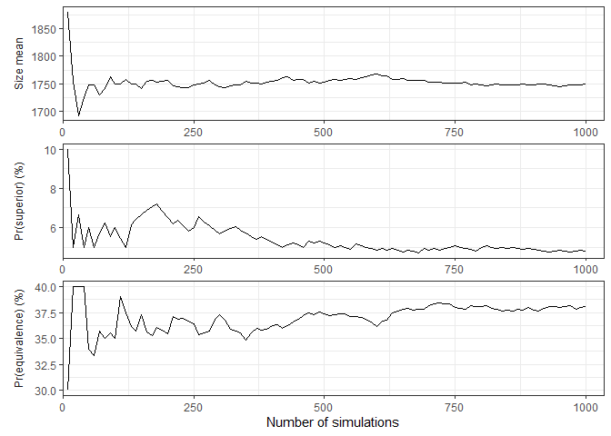
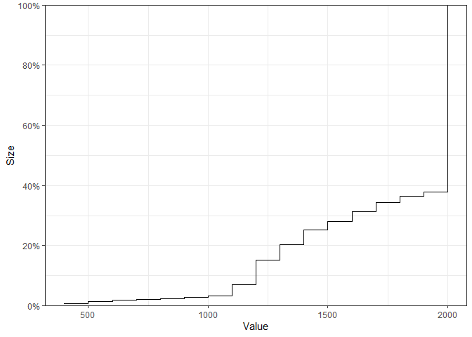
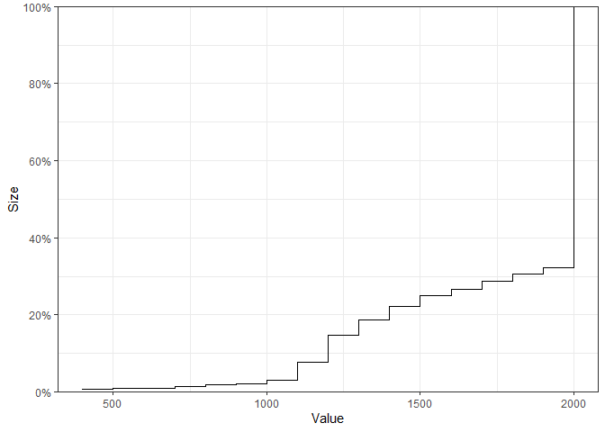
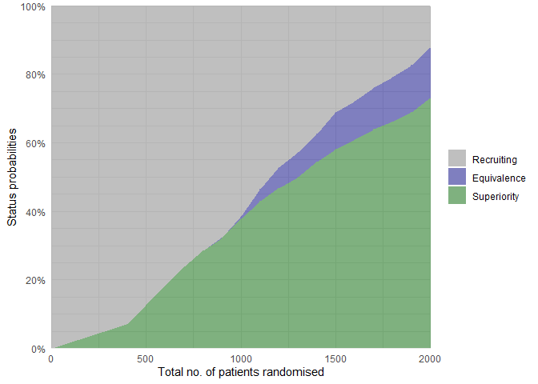

<!-- README.md is generated from README.Rmd. Please edit that file -->

# adaptr 

<!-- badges: start -->

[](https://cran.r-project.org/package=adaptr)
[](https://github.com/INCEPTdk/adaptr/actions/)
[](https://joss.theoj.org/papers/10.21105/joss.04284)
[](https://app.codecov.io/gh/INCEPTdk/adaptr/)

<!-- badges: end -->

The `adaptr` package simulates adaptive (multi-arm, multi-stage)
clinical trials using adaptive stopping, adaptive arm dropping and/or
response-adaptive randomisation.

The package has been developed as part of the [INCEPT (Intensive Care
Platform Trial) project](https://incept.dk/), primarily supported by a
grant from [Sygeforsikringen “danmark”](https://www.sygeforsikring.dk/).

## Resources

-   [Website](https://inceptdk.github.io/adaptr/) - stand-alone website
    with full package documentation
-   [adaptr: an R package for simulating and comparing adaptive clinical
    trials](https://doi.org/10.21105/joss.04284) - article in the
    Journal of Open Source Software describing the package
-   [An overview of methodological considerations regarding adaptive
    stopping, arm dropping and randomisation in clinical
    trials](https://doi.org/10.1016/j.jclinepi.2022.11.002) - article in
    Journal of Clinical Epidemiology describing key methodological
    considerations in adaptive trials with description of the workflow
    and a simulation-based example using the package

**Examples:**

-   [Effects of duration of follow-up and lag in data collection on the
    performance of adaptive clinical
    trials](https://doi.org/10.1002/pst.2342) - article in
    Pharmaceutical Statistics describing a simulation study (with code)
    using `adaptr` to assess the performance of adaptive clinical trials
    according to different follow-up/data collection lags.
-   [Effects of sceptical priors on the performance of adaptive clinical
    trials with binary outcomes](https://doi.org/10.1002/pst.2387) -
    article in Pharmaceutical Statistics describing a simulation study
    (with code) using `adaptr` to assess the performance of adaptive
    clinical trials according to different sceptical priors.

## Installation

The easiest way is to install from CRAN directly:

``` r
install.packages("adaptr")
```

Alternatively, you can install the **development version** from GitHub -
this requires the *remotes*-package installed. The development version
may contain additional features not yet available in the CRAN version,
but may not be stable or fully documented:

``` r
# install.packages("remotes") 
remotes::install_github("INCEPTdk/adaptr@dev")
```

## Usage and workflow overview

The central functionality of `adaptr` and the typical workflow is
illustrated here.

### Setup

First, the package is loaded and a cluster of parallel workers is
initiated by the `setup_cluster()` function to facilitate parallel
computing:

``` r
library(adaptr)
#> Loading 'adaptr' package v1.3.2.9000.
#> For instructions, type 'help("adaptr")'
#> or see https://inceptdk.github.io/adaptr/.

setup_cluster(2)
```

### Specify trial design

Setup a trial specification (defining the trial design and scenario)
using the general `setup_trial()` function, or one of the special case
variants using default priors `setup_trial_binom()` (for binary,
binomially distributed outcomes; used in this example) or
`setup_trial_norm()` (for continuous, normally distributed outcomes).

``` r
# Setup a trial using a binary, binomially distributed, undesirable outcome
binom_trial <- setup_trial_binom(
  arms = c("Arm A", "Arm B", "Arm C"),
  # Scenario with identical outcomes in all arms
  true_ys = c(0.25, 0.25, 0.25),
  # Response-adaptive randomisation with minimum 20% allocation in all arms
  min_probs = rep(0.20, 3),
  # Number of patients with data available at each analysis
  data_looks = seq(from = 300, to = 2000, by = 100),
  # Number of patients randomised at each analysis (higher than the numbers
  # with data, except at last look, due to follow-up/data collection lag)
  randomised_at_looks = c(seq(from = 400, to = 2000, by = 100), 2000),
  # Stopping rules for inferiority/superiority not explicitly defined
  # Stop for equivalence at > 90% probability of differences < 5 %-points
  equivalence_prob = 0.9,
  equivalence_diff = 0.05
)

# Print trial specification
print(binom_trial, prob_digits = 3)
#> Trial specification: generic binomially distributed outcome trial
#> * Undesirable outcome
#> * No common control arm
#> * Best arms: Arm A and Arm B and Arm C
#> 
#> Arms, true outcomes, starting allocation probabilities 
#> and allocation probability limits:
#>   arms true_ys start_probs fixed_probs min_probs max_probs
#>  Arm A    0.25       0.333          NA       0.2        NA
#>  Arm B    0.25       0.333          NA       0.2        NA
#>  Arm C    0.25       0.333          NA       0.2        NA
#> 
#> Maximum sample size: 2000 
#> Maximum number of data looks: 18
#> Planned data looks after:  300, 400, 500, 600, 700, 800, 900, 1000, 1100, 1200, 1300, 1400, 1500, 1600, 1700, 1800, 1900, 2000 patients have reached follow-up
#> Number of patients randomised at each look:  400, 500, 600, 700, 800, 900, 1000, 1100, 1200, 1300, 1400, 1500, 1600, 1700, 1800, 1900, 2000, 2000
#> 
#> Superiority threshold: 0.99 (all analyses)
#> Inferiority threshold: 0.01 (all analyses)
#> Equivalence threshold: 0.9 (all analyses) (no common control)
#> Absolute equivalence difference: 0.05
#> No futility threshold (not relevant - no common control)
#> Soften power for all analyses: 1 (no softening)
```

### Calibration

In the example trial specification, there are no true between-arm
differences, and stopping rules for inferiority and superiority are not
explicitly defined. This is intentional, as these stopping rules will be
calibrated to obtain a desired probability of stopping for superiority
in the scenario with no between-arm differences (corresponding to the
Bayesian type 1 error rate). Trial specifications do not necessarily
have to be calibrated, and simulations can be run directly using the
`run_trials()` function covered below (or `run_trial()` for a single
simulation).

Calibration of a trial specification is done using the
`calibrate_trial()` function, which defaults to calibrate constant,
symmetrical stopping rules for inferiority and superiority (expecting a
trial specification with identical outcomes in each arm), but can be
used to calibrate any parameter in a trial specification towards any
performance metric.

``` r
# Calibrate the trial specification
calibrated_binom_trial <- calibrate_trial(
  trial_spec = binom_trial,
  n_rep = 1000, # 1000 simulations for each step (more generally recommended)
  base_seed = 4131, # Base random seed (for reproducible results)
  target = 0.05, # Target value for calibrated metric (default value)
  search_range = c(0.9, 1), # Search range for superiority stopping threshold
  tol = 0.01, # Tolerance range
  dir = -1 # Tolerance range only applies below target
)

# Print result (to check if calibration is successful)
calibrated_binom_trial
#> Trial calibration:
#> * Result: calibration successful
#> * Best x: 0.9814318
#> * Best y: 0.048
#> 
#> Central settings:
#> * Target: 0.05
#> * Tolerance: 0.01 (at or below target, range: 0.04 to 0.05)
#> * Search range: 0.9 to 1
#> * Gaussian process controls:
#> * - resolution: 5000
#> * - kappa: 0.5
#> * - pow: 1.95
#> * - lengthscale: 1 (constant)
#> * - x scaled: yes
#> * Noisy: no
#> * Narrowing: yes
#> 
#> Calibration/simulation details:
#> * Total evaluations: 7 (previous + grid + iterations)
#> * Repetitions: 1000
#> * Calibration time: 3.12 mins
#> * Base random seed: 4131
#> 
#> See 'help("calibrate_trial")' for details.
```

The calibration is successful - the calibrated, constant stopping
threshold for superiority is printed with the results (0.9814318) and
can be extracted using `calibrated_binom_trial$best_x`. Using the
default calibration functionality, the calibrated, constant stopping
threshold for inferiority is symmetrical, i.e.,
`1 - stopping threshold for superiority` (0.0185682). The calibrated
trial specification may be extracted using
`calibrated_binom_trial$best_trial_spec` and, if printed, will also
include the calibrated stopping thresholds.

Calibration results may be saved (and reloaded) by using the `path`
argument, to avoid unnecessary repeated simulations.

### Summarising results

The results of the simulations using the calibrated trial specification
conducted during the calibration procedure may be extracted using
`calibrated_binom_trial$best_sims`. These results can be summarised with
several functions. Most of these functions support different ‘selection
strategies’ for simulations not ending with superiority, i.e.,
performance metrics can be calculated assuming different arms would be
used in clinical practice if no arm is ultimately superior.

The `check_performance()` function summarises performance metrics in a
tidy `data.frame`, with uncertainty measures (bootstrapped confidence
intervals) if requested. Here, performance metrics are calculated
considering the ‘best’ arm (i.e., the one with the highest probability
of being overall best) selected in simulations not ending with
superiority:

``` r
# Calculate performance metrics with uncertainty measures
binom_trial_performance <- check_performance(
  calibrated_binom_trial$best_sims,
  select_strategy = "best",
  uncertainty = TRUE, # Calculate uncertainty measures
  n_boot = 1000, # 1000 bootstrap samples (more typically recommended)
  ci_width = 0.95, # 95% confidence intervals (default)
  boot_seed = "base" # Use same random seed for bootstrapping as for simulations
)

# Print results 
print(binom_trial_performance, digits = 2)
#>                   metric     est err_sd err_mad   lo_ci   hi_ci
#> 1           n_summarised 1000.00   0.00    0.00 1000.00 1000.00
#> 2              size_mean 1749.60  11.36   10.97 1727.20 1772.10
#> 3                size_sd  373.74   9.64    9.74  355.15  392.58
#> 4            size_median 2000.00   0.00    0.00 2000.00 2000.00
#> 5               size_p25 1400.00  52.43    0.00 1400.00 1500.00
#> 6               size_p75 2000.00   0.00    0.00 2000.00 2000.00
#> 7                size_p0  400.00     NA      NA      NA      NA
#> 8              size_p100 2000.00     NA      NA      NA      NA
#> 9            sum_ys_mean  438.69   2.95    2.85  432.74  444.66
#> 10             sum_ys_sd   96.20   2.42    2.37   91.28  100.79
#> 11         sum_ys_median  486.00   1.98    2.97  483.00  490.00
#> 12            sum_ys_p25  364.75  10.95    9.64  352.00  395.00
#> 13            sum_ys_p75  506.00   1.15    1.48  504.00  508.00
#> 14             sum_ys_p0   88.00     NA      NA      NA      NA
#> 15           sum_ys_p100  565.00     NA      NA      NA      NA
#> 16         ratio_ys_mean    0.25   0.00    0.00    0.25    0.25
#> 17           ratio_ys_sd    0.01   0.00    0.00    0.01    0.01
#> 18       ratio_ys_median    0.25   0.00    0.00    0.25    0.25
#> 19          ratio_ys_p25    0.24   0.00    0.00    0.24    0.24
#> 20          ratio_ys_p75    0.26   0.00    0.00    0.26    0.26
#> 21           ratio_ys_p0    0.20     NA      NA      NA      NA
#> 22         ratio_ys_p100    0.30     NA      NA      NA      NA
#> 23       prob_conclusive    0.43   0.02    0.01    0.40    0.46
#> 24         prob_superior    0.05   0.01    0.01    0.04    0.06
#> 25      prob_equivalence    0.38   0.02    0.01    0.35    0.41
#> 26         prob_futility    0.00   0.00    0.00    0.00    0.00
#> 27              prob_max    0.57   0.02    0.01    0.54    0.60
#> 28 prob_select_arm_Arm A    0.32   0.02    0.01    0.29    0.35
#> 29 prob_select_arm_Arm B    0.31   0.01    0.01    0.28    0.34
#> 30 prob_select_arm_Arm C    0.37   0.02    0.02    0.34    0.40
#> 31      prob_select_none    0.00   0.00    0.00    0.00    0.00
#> 32                  rmse    0.02   0.00    0.00    0.02    0.02
#> 33               rmse_te      NA     NA      NA      NA      NA
#> 34                   mae    0.01   0.00    0.00    0.01    0.01
#> 35                mae_te      NA     NA      NA      NA      NA
#> 36                   idp      NA     NA      NA      NA      NA
```

Similar results in `list` format (without uncertainty measures) can be
obtained using the `summary()` method, which comes with a `print()`
method providing formatted results:

``` r
binom_trial_summary <- summary(
  calibrated_binom_trial$best_sims,
  select_strategy = "best"
)

print(binom_trial_summary)
#> Multiple simulation results: generic binomially distributed outcome trial
#> * Undesirable outcome
#> * Number of simulations: 1000
#> * Number of simulations summarised: 1000 (all trials)
#> * No common control arm
#> * Selection strategy: best remaining available
#> * Treatment effect compared to: no comparison
#> 
#> Performance metrics (using posterior estimates from final analysis [all patients]):
#> * Sample sizes: mean 1749.6 (SD: 373.7) | median 2000.0 (IQR: 1400.0 to 2000.0) [range: 400.0 to 2000.0]
#> * Total summarised outcomes: mean 438.7 (SD: 96.2) | median 486.0 (IQR: 364.8 to 506.0) [range: 88.0 to 565.0]
#> * Total summarised outcome rates: mean 0.251 (SD: 0.011) | median 0.250 (IQR: 0.244 to 0.258) [range: 0.198 to 0.295]
#> * Conclusive: 42.9%
#> * Superiority: 4.8%
#> * Equivalence: 38.1%
#> * Futility: 0.0% [not assessed]
#> * Inconclusive at max sample size: 57.1%
#> * Selection probabilities: Arm A: 31.8% | Arm B: 31.0% | Arm C: 37.2% | None: 0.0%
#> * RMSE / MAE: 0.01730 / 0.01102
#> * RMSE / MAE treatment effect: not estimated / not estimated
#> * Ideal design percentage: not estimable
#> 
#> Simulation details:
#> * Simulation time: 29.4 secs
#> * Base random seed: 4131
#> * Credible interval width: 95%
#> * Number of posterior draws: 5000
#> * Estimation method: posterior medians with MAD-SDs
```

Individual simulation results may be extracted in a tidy `data.frame`
using `extract_results()`.

Finally, the probabilities of different remaining arms and their
statuses (with uncertainty) at the last adaptive analysis can be
summarised using the `check_remaining_arms()` function.

### Visualising results

Several visualisation functions are included (all are optional, and all
require the `ggplot2` package installed).

Convergence and stability of one or more performance metrics may be
visually assessed using `plot_convergence()` function:

``` r
plot_convergence(
  calibrated_binom_trial$best_sims,
  metrics = c("size mean", "prob_superior", "prob_equivalence"),
  # select_strategy can be specified, but does not affect the chosen metrics
)
```



The empirical cumulative distribution functions for continuous
performance metrics may also be visualised:

``` r
plot_metrics_ecdf(
  calibrated_binom_trial$best_sims, 
  metrics = "size"
)
```



The status probabilities for the overall trial (or for specific arms)
according to trial progress can be visualised using the `plot_status()`
function:

``` r
# Overall trial status probabilities
plot_status(
  calibrated_binom_trial$best_sims,
  x_value = "total n" # Total number of randomised patients at X-axis
)
```



Finally, various metrics may be summarised over the progress of one or
multiple trial simulations using the `plot_history()` function, which
requires non-sparse results (the `sparse` argument must be `FALSE` in
`calibrate_trials()`, `run_trials()`, or `run_trial()`, leading to
additional results being saved).

### Use calibrated stopping thresholds in another scenario

The calibrated stopping thresholds (calibrated in a scenario with no
between-arm differences) may be used to run simulations with the same
overall trial specification, but according to a different scenario
(i.e., with between-arm differences present) to assess performance
metrics (including the Bayesian analogue of power).

First, a new trial specification is setup using the same settings as
before, except for between-arm differences and the calibrated stopping
thresholds:

``` r
binom_trial_calib_diff <- setup_trial_binom(
  arms = c("Arm A", "Arm B", "Arm C"),
  true_ys = c(0.25, 0.20, 0.30), # Different outcomes in the arms
  min_probs = rep(0.20, 3),
  data_looks = seq(from = 300, to = 2000, by = 100),
  randomised_at_looks = c(seq(from = 400, to = 2000, by = 100), 2000),
  # Stopping rules for inferiority/superiority explicitly defined
  # using the calibration results
  inferiority = 1 - calibrated_binom_trial$best_x,
  superiority = calibrated_binom_trial$best_x,
  equivalence_prob = 0.9,
  equivalence_diff = 0.05
)
```

Simulations using the trial specification with calibrated stopping
thresholds and differences present can then be conducted using the
`run_trials()` function and performance metrics calculated as above:

``` r
binom_trial_diff_sims <- run_trials(
  binom_trial_calib_diff,
  n_rep = 1000, # 1000 simulations (more generally recommended)
  base_seed = 1234 # Reproducible results
)

check_performance(
  binom_trial_diff_sims,
  select_strategy = "best",
  uncertainty = TRUE,
  n_boot = 1000, # 1000 bootstrap samples (more typically recommended)
  ci_width = 0.95,
  boot_seed = "base"
)
#>                   metric      est err_sd err_mad    lo_ci    hi_ci
#> 1           n_summarised 1000.000  0.000   0.000 1000.000 1000.000
#> 2              size_mean 1242.300 16.620  16.976 1209.895 1273.025
#> 3                size_sd  531.190  7.251   7.604  516.617  544.091
#> 4            size_median 1200.000 22.220   0.000 1200.000 1300.000
#> 5               size_p25  800.000 36.095   0.000  700.000  800.000
#> 6               size_p75 1700.000 42.453   0.000 1700.000 1800.000
#> 7                size_p0  400.000     NA      NA       NA       NA
#> 8              size_p100 2000.000     NA      NA       NA       NA
#> 9            sum_ys_mean  284.999  3.695   3.726  277.724  291.991
#> 10             sum_ys_sd  117.265  1.701   1.732  113.765  120.311
#> 11         sum_ys_median  279.000  5.268   4.448  269.500  289.512
#> 12            sum_ys_p25  186.000  6.682   7.413  174.000  197.019
#> 13            sum_ys_p75  390.000  7.633   7.413  374.000  402.250
#> 14             sum_ys_p0   81.000     NA      NA       NA       NA
#> 15           sum_ys_p100  519.000     NA      NA       NA       NA
#> 16         ratio_ys_mean    0.232  0.000   0.001    0.231    0.233
#> 17           ratio_ys_sd    0.016  0.000   0.000    0.015    0.017
#> 18       ratio_ys_median    0.230  0.001   0.000    0.230    0.232
#> 19          ratio_ys_p25    0.221  0.000   0.000    0.220    0.222
#> 20          ratio_ys_p75    0.242  0.001   0.001    0.240    0.243
#> 21           ratio_ys_p0    0.195     NA      NA       NA       NA
#> 22         ratio_ys_p100    0.298     NA      NA       NA       NA
#> 23       prob_conclusive    0.877  0.011   0.010    0.857    0.898
#> 24         prob_superior    0.731  0.014   0.015    0.706    0.759
#> 25      prob_equivalence    0.146  0.011   0.011    0.125    0.167
#> 26         prob_futility    0.000  0.000   0.000    0.000    0.000
#> 27              prob_max    0.123  0.011   0.010    0.102    0.143
#> 28 prob_select_arm_Arm A    0.038  0.006   0.006    0.026    0.049
#> 29 prob_select_arm_Arm B    0.962  0.006   0.006    0.951    0.974
#> 30 prob_select_arm_Arm C    0.000  0.000   0.000    0.000    0.000
#> 31      prob_select_none    0.000  0.000   0.000    0.000    0.000
#> 32                  rmse    0.020  0.001   0.001    0.019    0.022
#> 33               rmse_te       NA     NA      NA       NA       NA
#> 34                   mae    0.011  0.000   0.000    0.010    0.012
#> 35                mae_te       NA     NA      NA       NA       NA
#> 36                   idp   98.100  0.306   0.297   97.549   98.700
```

Again, simulations may be saved and reloaded using the `path` argument.

Similarly, overall trial statuses for the scenario with differences can
be visualised:

``` r
plot_status(binom_trial_diff_sims, x_value = "total n")
```



## Issues and enhancements

We use the [GitHub issue
tracker](https://github.com/INCEPTdk/adaptr/issues) for all bug/issue
reports and proposals for enhancements.

## Contributing

We welcome contributions directly to the code to improve performance as
well as new functionality. For the latter, please first explain and
motivate it in an [issue](https://github.com/INCEPTdk/adaptr/issues).

Changes to the code base should follow these steps:

-   [Fork](https://docs.github.com/en/get-started/quickstart/fork-a-repo)
    the repository
-   [Make a
    branch](https://docs.github.com/en/pull-requests/collaborating-with-pull-requests/proposing-changes-to-your-work-with-pull-requests/creating-and-deleting-branches-within-your-repository)
    with an appropriate name in your fork
-   Implement changes in your fork, make sure it passes R CMD check
    (with neither errors, warnings, nor notes) and add a bullet at the
    top of NEWS.md with a short description of the change, your GitHub
    handle and the id of the pull request implementing the change (check
    the `NEWS.md` file to see the formatting)
-   Create a [pull
    request](https://docs.github.com/en/pull-requests/collaborating-with-pull-requests/proposing-changes-to-your-work-with-pull-requests/creating-a-pull-request-from-a-fork)
    into the `dev` branch of `adaptr`

## Citation

If you use the package, please consider citing it:

``` r
citation(package = "adaptr")
#> 
#> To cite package 'adaptr' in publications use:
#> 
#>   Granholm A, Jensen AKG, Lange T, Kaas-Hansen BS (2022). adaptr: an R
#>   package for simulating and comparing adaptive clinical trials.
#>   Journal of Open Source Software, 7(72), 4284. URL
#>   https://doi.org/10.21105/joss.04284.
#> 
#> A BibTeX entry for LaTeX users is
#> 
#>   @Article{,
#>     title = {{adaptr}: an R package for simulating and comparing adaptive clinical trials},
#>     author = {Anders Granholm and Aksel Karl Georg Jensen and Theis Lange and Benjamin Skov Kaas-Hansen},
#>     journal = {Journal of Open Source Software},
#>     year = {2022},
#>     volume = {7},
#>     number = {72},
#>     pages = {4284},
#>     url = {https://doi.org/10.21105/joss.04284},
#>     doi = {10.21105/joss.04284},
#>   }
```
