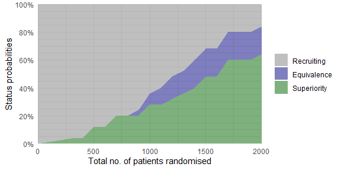

<!-- README.md is generated from README.Rmd. Please edit that file -->

# adaptr 

<!-- badges: start -->

[](https://cran.r-project.org/package=adaptr)
[](https://github.com/INCEPTdk/adaptr/actions/)
[](https://joss.theoj.org/papers/10.21105/joss.04284)
[](https://app.codecov.io/gh/INCEPTdk/adaptr/)

<!-- badges: end -->

The `adaptr` package simulates adaptive (multi-arm, multi-stage)
clinical trials using adaptive stopping, adaptive arm dropping and/or
response-adaptive randomisation.

The package has been developed as part of the [INCEPT (Intensive Care
Platform Trial) project](https://incept.dk/), which is primarily
supported by a grant from [Sygeforsikringen
“danmark”](https://www.sygeforsikring.dk/).

## Resources

-   [Website](https://inceptdk.github.io/adaptr/) - stand-alone website
    with full package documentation
-   [adaptr: an R package for simulating and comparing adaptive clinical
    trials](https://doi.org/10.21105/joss.04284) - article in the
    Journal of Open Source Software describing the package
-   [An overview of methodological considerations regarding adaptive
    stopping, arm dropping and randomisation in clinical
    trials](https://doi.org/10.1016/j.jclinepi.2022.11.002) - article in
    Journal of Clinical Epidemiology describing key methodological
    considerations in adaptive trials with description of the workflow
    and a simulation-based example using the package

## Installation

The easiest way is to install from CRAN directly:

``` r
install.packages("adaptr")
```

Alternatively, you can install the **development version** from GitHub -
this requires the *remotes*-package installed. The development version
may contain additional features not yet available in the CRAN version
(including preliminary functions) and may not be stable or fully
documented:

``` r
# install.packages("remotes") 
remotes::install_github("INCEPTdk/adaptr@dev")
```

## Example

The basic functionality of `adaptr` is illustrated below.

First, load the library and setup a trial specification using the
general `setup_trial()` function, or one of the special case functions,
`setup_trial_binom()` (used in the example) or `setup_trial_norm()`.

``` r
library(adaptr)
#> Loading adaptr package (version 1.1.2).
#> See 'help("adaptr")' or 'vignette("Overview", "adaptr")' for help.
#> Further information available on https://inceptdk.github.io/adaptr/.

# Setup a trial using a binary, binomially distributed, undesirable outcome
binom_trial <- setup_trial_binom(
  arms = c("Arm A", "Arm B", "Arm C"),
  true_ys = c(0.25, 0.20, 0.30),
  min_probs = rep(0.15, 3), # Minimum allocation of 15% in all arms
  data_looks = seq(from = 300, to = 2000, by = 100),
  # Stop for equivalence at > 90% probability of differences < 5 %-points
  equivalence_prob = 0.9,
  equivalence_diff = 0.05,
  soften_power = 0.5 # Soften allocation ratios
)

# Print trial specification
print(binom_trial, prob_digits = 3)
#> Trial specification: generic binomially distributed outcome trial
#> * Undesirable outcome
#> * No common control arm
#> * Best arm: Arm B
#> 
#> Arms, true outcomes, starting allocation probabilities 
#> and allocation probability limits:
#>   arms true_ys start_probs fixed_probs min_probs max_probs
#>  Arm A    0.25       0.333          NA      0.15        NA
#>  Arm B    0.20       0.333          NA      0.15        NA
#>  Arm C    0.30       0.333          NA      0.15        NA
#> 
#> Maximum sample size: 2000 
#> Maximum number of data looks: 18
#> Planned data looks after:  300, 400, 500, 600, 700, 800, 900, 1000, 1100, 1200, 1300, 1400, 1500, 1600, 1700, 1800, 1900, 2000 patients have reached follow-up
#> Number of patients randomised at each look:  300, 400, 500, 600, 700, 800, 900, 1000, 1100, 1200, 1300, 1400, 1500, 1600, 1700, 1800, 1900, 2000
#> 
#> Superiority threshold: 0.99 (all analyses)
#> Inferiority threshold: 0.01 (all analyses)
#> Equivalence threshold: 0.9 (all analyses) (no common control)
#> Absolute equivalence difference: 0.05
#> No futility threshold (not relevant - no common control)
#> Soften power for all analyses: 0.5
```

Simulate a single trial using a reproducible random seed:

``` r
trial_res <- run_trial(binom_trial, seed = 12345)
print(trial_res, digits = 3)
#> Single simulation result: generic binomially distributed outcome trial
#> * Undesirable outcome
#> * No common control arm
#> 
#> Final status: inconclusive, stopped at final allowed adaptive analysis
#> Final/maximum allowed sample sizes: 2000/2000 (100.0%)
#> Available outcome data at last adaptive analysis: 2000/2000 (100.0%)
#> 
#> Trial results overview:
#>   arms true_ys final_status status_look status_probs final_alloc
#>  Arm A    0.25       active          NA           NA       0.194
#>  Arm B    0.20       active          NA           NA       0.656
#>  Arm C    0.30     inferior        2000        0.007       0.150
#> 
#> Esimates from final analysis (all patients):
#>   arms sum_ys_all ns_all raw_ests_all post_ests_all post_errs_all lo_cri_all
#>  Arm A        180    742        0.243         0.243        0.0161      0.213
#>  Arm B        178    841        0.212         0.212        0.0141      0.185
#>  Arm C        113    417        0.271         0.272        0.0221      0.230
#>  hi_cri_all
#>       0.274
#>       0.240
#>       0.316
#> 
#> Estimates from last adaptive analysis including each arm:
#>   arms sum_ys  ns raw_ests post_ests post_errs lo_cri hi_cri
#>  Arm A    180 742    0.243     0.243    0.0159  0.213  0.275
#>  Arm B    178 841    0.212     0.212    0.0141  0.185  0.241
#>  Arm C    113 417    0.271     0.271    0.0215  0.230  0.316
#> 
#> Simulation details:
#> * Random seed: 12345
#> * Credible interval width: 95%
#> * Number of posterior draws: 5000
#> * Posterior estimation method: medians with MAD-SDs
```

Simulate multiple trials using a reproducible random seed:

``` r
# Simulate multiple trials - only 10 simulations for speed in the example
trial_res_mult <- run_trials(binom_trial, n_rep = 10, base_seed = 67890)

# Extract results in a tidy data.frame (1 simulation per row)
# See function documentation for details, including on arm selection in trials
# not ending with a superior arm
extr_res <- extract_results(trial_res_mult)
head(extr_res)
#>   sim final_n sum_ys  ratio_ys final_status superior_arm selected_arm
#> 1   1    2000    415 0.2075000          max         <NA>         <NA>
#> 2   2     600    139 0.2316667  superiority        Arm B        Arm B
#> 3   3    1000    237 0.2370000  superiority        Arm B        Arm B
#> 4   4     900    209 0.2322222  equivalence         <NA>         <NA>
#> 5   5    2000    441 0.2205000  superiority        Arm B        Arm B
#> 6   6    1900    431 0.2268421  superiority        Arm B        Arm B
#>         sq_err sq_err_te
#> 1           NA        NA
#> 2 7.853843e-04        NA
#> 3 4.190319e-05        NA
#> 4           NA        NA
#> 5 3.422824e-06        NA
#> 6 4.852161e-05        NA

# Summarise trial results
# See function documentation for details, including on arm selection in trials
# not ending with a superior arm
res_sum <- summary(trial_res_mult)
print(res_sum, digits = 1)
#> Multiple simulation results: generic binomially distributed outcome trial
#> * Undesirable outcome
#> * Number of simulations: 10
#> * Number of simulations summarised: 10 (all trials)
#> * No common control arm
#> * Selection strategy: no selection if no superior arm
#> * Treatment effect compared to: no comparison
#> 
#> Performance metrics (using posterior estimates from last adaptive analysis):
#> * Sample sizes: mean 1470.0 (SD: 559.9) | median 1550.0 (IQR: 1025.0 to 2000.0)
#> * Total summarised outcomes: mean 323.3 (SD: 110.6) | median 340.0 (IQR: 242.0 to 421.8)
#> * Total summarised outcome rates: mean 0.224 (SD: 0.013) | median 0.229 (IQR: 0.214 to 0.233)
#> * Conclusive: 70.0%
#> * Superiority: 50.0%
#> * Equivalence: 20.0%
#> * Futility: 0.0% [not assessed]
#> * Inconclusive at max sample size: 30.0%
#> * Selection probabilities: Arm A: 0.0% | Arm B: 50.0% | Arm C: 0.0% | None: 50.0%
#> * RMSE: 0.01330
#> * RMSE treatment effect: not estimated
#> * Ideal design percentage: 100.0%
#> 
#> Simulation details:
#> * Simulation time: 0.448 secs
#> * Base random seed: 67890
#> * Credible interval width: 95%
#> * Number of posterior draws: 5000
#> * Estimation method: posterior medians with MAD-SDs
```

Performance metrics may also be calculated and returned in a tidy
`data.frame` (with bootstrapped uncertainty measures, if requested) by
the `check_performance()` function, and the `plot_convergence()`
function may be used to visually assess stability of performance metrics
according to the number of simulations.

Plot trial statuses or history of trial metrics over time:

``` r
# Simulate multiple trials - 25 simulations only for speed
# sparse = FALSE is required for plot_history (but not plot_status)
trial_res_mult <- run_trials(binom_trial, n_rep = 25, base_seed = 67890, sparse = FALSE)

# Plot overall trial statuses according to the total number
# of patients randomised
plot_status(trial_res_mult, x_value = "total n")
```



``` r
# Plot allocation probabilities at each adaptive look (requires sparse = FALSE)
plot_history(trial_res_mult)
```


Plotting statuses for individual trial arms and other summary metrics is
possible, too.

## Issues and enhancements

We use the [GitHub issue
tracker](https://github.com/INCEPTdk/adaptr/issues) for all bug/issue
reports and proposals for enhancements.

## Contributing

We welcome contributions directly to the code to improve performance as
well as new functionality. For the latter, please first explain and
motivate it in an [issue](https://github.com/INCEPTdk/adaptr/issues).

Changes to the code base should follow these steps:

-   [Fork](https://docs.github.com/en/get-started/quickstart/fork-a-repo)
    the repository
-   [Make a
    branch](https://docs.github.com/en/pull-requests/collaborating-with-pull-requests/proposing-changes-to-your-work-with-pull-requests/creating-and-deleting-branches-within-your-repository)
    with an appropriate name in your fork
-   Implement changes in your fork, make sure it passes R CMD check
    (with neither errors, warnings, nor notes) and add a bullet at the
    top of NEWS.md with a short description of the change, your GitHub
    handle and the id of the pull request implementing the change (check
    the `NEWS.md` file to see the formatting)
-   Create a [pull
    request](https://docs.github.com/en/pull-requests/collaborating-with-pull-requests/proposing-changes-to-your-work-with-pull-requests/creating-a-pull-request-from-a-fork)
    into the `dev` branch of `adaptr`

## Citation

If using the package, please consider citing it:

``` r
citation(package = "adaptr")
#> 
#> To cite adaptr in publications use:
#> 
#>   Granholm A, Jensen AKG, Lange T, Kaas-Hansen BS (2022). adaptr: an R
#>   package for simulating and comparing adaptive clinical trials.
#>   Journal of Open Source Software, 7(72), 4284. URL
#>   https://doi.org/10.21105/joss.04284.
#> 
#> A BibTeX entry for LaTeX users is
#> 
#>   @Article{,
#>     title = {{adaptr}: an R package for simulating and comparing adaptive clinical trials},
#>     author = {Anders Granholm and Aksel Karl Georg Jensen and Theis Lange and Benjamin Skov Kaas-Hansen},
#>     journal = {Journal of Open Source Software},
#>     year = {2022},
#>     volume = {7},
#>     number = {72},
#>     pages = {4284},
#>     url = {https://doi.org/10.21105/joss.04284},
#>     doi = {10.21105/joss.04284},
#>   }
```
