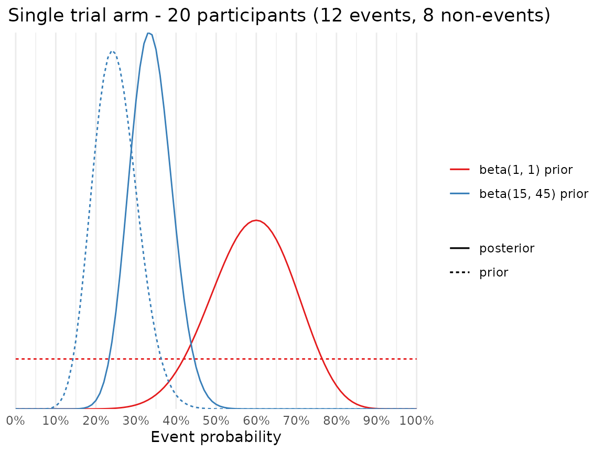
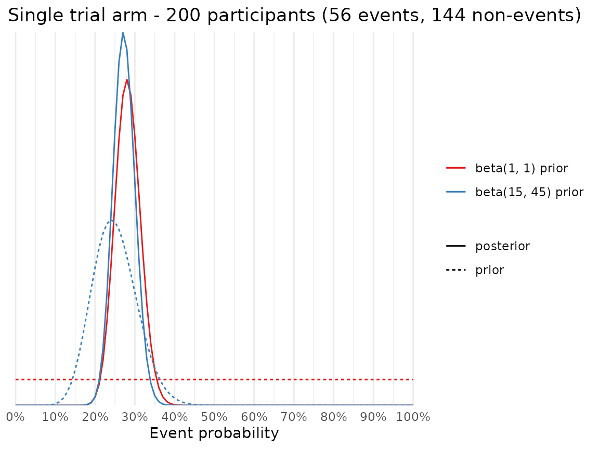

# Advanced example

This vignette provides an **advanced** example on how to:

1.  Specify a trial design with
    [`setup_trial()`](https://inceptdk.github.io/adaptr/reference/setup_trial.md)
    using user-written functions for generating outcomes and drawing
    samples from the posterior distributions
2.  Transform the raw outcome estimates in a way appropriate for your
    needs
3.  Derive and specify prior probability distributions

The manual for
[`setup_trial()`](https://inceptdk.github.io/adaptr/reference/setup_trial.md)
contains another example (more succinctly annotated); see the
**Examples** sections in `?setup_trial()`. As an alternative to using
custom functions, the convenience functions
[`setup_trial_binom()`](https://inceptdk.github.io/adaptr/reference/setup_trial_binom.md)
and
[`setup_trial_norm()`](https://inceptdk.github.io/adaptr/reference/setup_trial_norm.md)
may be used for simulating trials with binary, binomially distributed or
continuous, normally distributed outcomes, using sensible defaults and
flat priors.

This vignette is intended for advanced users and assume general
knowledge of writing `R` functions and specifying prior distributions
for (simple, conjugate) Bayesian models. Before reading this vignette,
we highly encourage you to read the Basic examples vignette (see
[`vignette("Basic-examples", "adaptr")`](https://inceptdk.github.io/adaptr/articles/Basic-examples.md))
with more basic examples using the simplified
[`setup_trial_binom()`](https://inceptdk.github.io/adaptr/reference/setup_trial_binom.md)
function and a thorough discussion of the settings applicable to all
trial designs.

In addition to this vignette, a detailed tutorial on how to design and
evaluate Bayesian advanced adaptive clinical trials can be found in the
open access article *“[Designing and Evaluating Bayesian Advanced
Adaptive Randomised Clinical Trials: A Practical
Guide](https://doi.org/10.1002/pst.70042)”* available in Pharmaceutical
Statistics. The supporting information (appendices) for this article
contains additional advanced examples.

## Preamble

In this example, we set up a trial with three `arms`, one of which is a
common `control`, and an undesirable binary outcome (e.g., mortality).

This examples creates a custom version of the
[`setup_trial_binom()`](https://inceptdk.github.io/adaptr/reference/setup_trial_binom.md)
function using non-flat priors for the event rates in each arm
([`setup_trial_binom()`](https://inceptdk.github.io/adaptr/reference/setup_trial_binom.md)
uses flat priors), and returning event probabilities as percentages
(instead of fractions), to illustrate the use of a custom function to
summarise the raw outcome data.

While
[`setup_trial()`](https://inceptdk.github.io/adaptr/reference/setup_trial.md)
attempts to validate the custom functions by assessing their output
during trial specification, some edge cases might elude this validation.
We, therefore, urge users specifying custom functions to carefully test
more complex functions themselves before actual use.

If you go through the trouble of writing a nice set of functions for
generating outcomes and sampling from posterior distributions, please
consider adding these to the package. This way, others can benefit from
your work and it helps validate them. See how on the
[GitHub](https://github.com/INCEPTdk/adaptr#contributing) page under
**Contributing**.

Although the user-written custom functions below do not depend on the
`adaptr` package, as the first thing we load the package:

``` r
library(adaptr)
#> Loading 'adaptr' package v1.5.0.
#> For instructions, type 'help("adaptr")'
#> or see https://inceptdk.github.io/adaptr/.
```

–and then set the global seed to ensure reproducible results in the
vignette:

``` r
set.seed(89)
```

We define the functions and (for illustration purposes and as a sanity
check) print their outputs. They are, then, invoked by
[`setup_trial()`](https://inceptdk.github.io/adaptr/reference/setup_trial.md)
(in the final code chunk of this vignette).

## Functions for generating outcomes

This function should take a single argument (`allocs`), a character
vector containing the allocations (names of trial `arms`) of all
participants included since the last adaptive analysis. The function
must return a *numeric* vector, regardless of actual outcome type (so,
e.g., categorical outcomes must be encoded as numeric). The returned
numeric vector must be of the same length, and the values in the same
order as `allocs`. That is, the third element of `allocs` specifies the
allocation of the third participant randomised since the last adaptive
analysis, and (correspondingly) the third element of the returned vector
is that participant’s outcome.

It sounds complicated, but it becomes clearer when we actually specify
the function (essentially a re-implementation of the built-in function
used by
[`setup_trial_binom()`](https://inceptdk.github.io/adaptr/reference/setup_trial_binom.md)):

``` r
get_ys_binom_custom <- function(allocs) {
  # Binary outcome coded as 0/1 - prepare returned vector of appropriate length
  y <- integer(length(allocs))
  
  # Specify trial arms and true event probabilities for each arm
  # These values should exactly match those supplied to setup_trial
  # NB! This is not validated, so this is the user's responsibility
  arms <- c("Control", "Experimental arm A", "Experimental arm B")
  true_ys <- c(0.25, 0.27, 0.20)
  
  # Loop through arms and generate outcomes
  for (i in seq_along(arms)) {
    # Indices of participants allocated to the current arm
    ii <- which(allocs == arms[i])
    # Generate outcomes for all participants allocated to current arm
    y[ii] <- rbinom(length(ii), 1, true_ys[i])
  }
  
  # Return outcome vector
  y
}
```

To illustrate how the function works, we first generate random
allocations for 50 participants using equal allocation probabilities,
the default behaviour of
[`sample()`](https://rdrr.io/r/base/sample.html). By enclosing the call
in parentheses, the resulting allocations are printed:

``` r
(allocs <- sample(c("Control", "Experimental arm A", "Experimental arm B"),
                  size = 50, replace = TRUE))
#>  [1] "Control"            "Experimental arm B" "Experimental arm B"
#>  [4] "Experimental arm B" "Experimental arm B" "Experimental arm A"
#>  [7] "Experimental arm A" "Experimental arm A" "Experimental arm A"
#> [10] "Experimental arm A" "Experimental arm B" "Experimental arm B"
#> [13] "Experimental arm B" "Control"            "Experimental arm B"
#> [16] "Control"            "Experimental arm A" "Experimental arm A"
#> [19] "Experimental arm A" "Experimental arm B" "Control"           
#> [22] "Control"            "Experimental arm B" "Control"           
#> [25] "Experimental arm A" "Control"            "Experimental arm A"
#> [28] "Control"            "Experimental arm B" "Experimental arm B"
#> [31] "Control"            "Experimental arm B" "Control"           
#> [34] "Control"            "Experimental arm A" "Experimental arm B"
#> [37] "Control"            "Experimental arm A" "Experimental arm A"
#> [40] "Experimental arm A" "Experimental arm B" "Experimental arm A"
#> [43] "Control"            "Experimental arm B" "Control"           
#> [46] "Control"            "Control"            "Control"           
#> [49] "Experimental arm A" "Experimental arm A"
```

Next, we generate random outcomes for these participants:

``` r
(ys <- get_ys_binom_custom(allocs))
#>  [1] 0 0 0 0 0 0 1 1 0 0 0 1 0 0 0 0 1 1 1 0 0 0 1 0 0 1 0 0 0 0 1 0 0 0 0 0 0 0
#> [39] 0 0 0 1 1 1 0 1 0 1 1 0
```

## Functions for drawing posterior samples

The
[`setup_trial_binom()`](https://inceptdk.github.io/adaptr/reference/setup_trial_binom.md)
function uses *beta-binomial conjugate prior models* in each arm, with
`beta(1, 1)` priors. These priors are uniform (≈ “non-informative”) on
the probability scale and corresponds to the same amount of information
as provided by 2 participants (1 with and 1 without an event), described
in greater detail by, e.g., *Ryan et al, 2019*
([10.1136/bmjopen-2018-024256](https://doi.org/10.1136/bmjopen-2018-024256)).

Our custom function for generating posterior draws also uses
beta-binomial conjugate prior models, but with informative priors.
Informative priors may prevent undue influence of random, early
fluctuations in a trial by pulling posterior estimates closer to the
prior when limited data are available.

We seek relatively weakly informative priors centred on previous
knowledge (or beliefs), and so before we can actually define a function
for generating posterior draws based on informative priors, we need to
derive such a prior.

### Informative priors

We assume that we have prior knowledge corresponding to a belief that
the best estimate for the true event probability in the `control` arm is
0.25 (25%), and that the true event probability is between 0.15 and 0.35
(15-35%) with 95% probability. The mean of a beta distribution is simply
`[number of events]/[number of participants]`.

To derive a beta distribution that reflects this prior belief, we use
[`find_beta_params()`](https://inceptdk.github.io/adaptr/reference/find_beta_params.md),
a helper function included in the `adaptr` (see
[`?find_beta_params`](https://inceptdk.github.io/adaptr/reference/find_beta_params.md)
for details):

``` r
find_beta_params(
  theta = 0.25, # Event probability
  boundary = "lower",
  boundary_target = 0.15,
  interval_width = 0.95
)
#>   alpha beta      p2.5     p50.0     p97.5
#> 1    15   45 0.1498208 0.2472077 0.3659499
```

We thus see that our prior belief prior roughly corresponds to previous
randomisation of 60 participants of whom 15 (`alpha`) experienced the
event and 45 (`beta`) did not.

Even though we may expect event probabilities to differ in the
non-control arms, for this example we consider this prior appropriate
for all arms as we consider event probabilities smaller/larger than
those represented by the prior unlikely.

Below, we illustrate the effects of this prior compared to the default
`beta(1, 1)` prior used in
[`setup_trial_binom()`](https://inceptdk.github.io/adaptr/reference/setup_trial_binom.md)
for a single trial arm with 20 participants randomised, 12 events and 8
non-events. This corresponds to an estimated event probability of 0.6
(60%), far more than the expected 0.25 (25%). This could come about by
random fluctuations when few participants have been randomised, even if
our prior beliefs are correct.



Next, we illustrate the effects on the same prior after 200 participants
have been randomised to the same arm, with 56 events and 144 non-events,
which corresponds to an estimated event probability of 0.28 (28%), which
is more similar to the expected event probability.



When comparing to the previous plot, we clearly see that once more
participants have been randomised, the larger sample of observed data
starts to dominate the posterior, so that the prior exerts less
influence on the posterior distribution (both posterior distributions
are very alike despite the very different prior distributions).

### Defining the function to generate posterior draws

There are a number of important things to be aware of when specifying
this function. First, it must accept all the following arguments (with
the exact same names, *even* if they are not used in the function):

- `arms`: character vector of the *currently active* `arms` in the
  trial.
- `allocs`: character vector of the allocations (trial `arms`) of *all*
  participants randomised in the trial, *including* those randomised to
  `arms` that are no longer active.
- `ys`: numeric vector of the outcomes of *all* participants randomised
  in the trial, *including* those randomised to `arms` that are no
  longer active.
- `control`: single character, the *current* `control` arm; `NULL` in
  trials without a common `control`.
- `n_draws`: single integer, the number of posterior draws to generate
  for *each* arm.

Alternatively, unused arguments can be left out and the ellipsis (`...`)
included as the final argument in your function.

Second, the order of `allocs` and `ys` must match: the fifth element of
`allocs` represents the allocation of the fifth participant, while the
fifth element of `ys` represent the outcome of the same participant.

Third, `allocs` and `ys` are provided for **all** participants,
including those randomised to `arms` that are no longer active. This is
done as users in some situations may want to use these data when
generating posterior draws for the other (and currently **active**)
`arms`.

Fourth, `adaptr` does not restrict how posterior samples are drawn.
Consequently, Markov chain Monte Carlo- or variational inference-based
methods may be used, and other packages supplying such functionality may
be called by user-provided functions. However, using more complex
methods than simple conjugate models substantially increases simulation
run time. Consequently, simpler models are well-suited for use in
simulations.

Fifth, the function must return a `matrix` of numeric values with
`length(arms)` columns and `n_draws` rows, with the **currently active**
`arms` as column names. That is, each row must contain one posterior
draw for each arm. `NA`’s are not allowed, so even if no participants
have been randomised to an arm yet, valid numeric values should be
returned (e.g., drawn from the prior or from another very diffuse
*posterior* distribution). Even if the outcome is not truly numeric,
both the vector of outcomes provided to the function (`ys`) and the
returned `matrix` with posterior draws must be encoded as numeric.

With this in mind, we are ready to specify the function:

``` r
get_draws_binom_custom <- function(arms, allocs, ys, control, n_draws) {
  # Setup a list to store the posterior draws for each arm
  draws <- list()
  
  # Loop through the ACTIVE arms and generate posterior draws
  for (a in arms) {
    # Indices of participants allocated to the current arm
    ii <- which(allocs == a)
    # Sum the number of events in the current arm
    n_events <- sum(ys[ii])
    # Compute the number of participants in the current arm
    n_participants <- length(ii)
    # Generate draws using the number of events, the number of participants
    # and the prior specified above: beta(15, 45)
    # Saved using the current arms' name in the list, ensuring that the
    # resulting matrix has column names corresponding to the ACTIVE arms
    draws[[a]] <- rbeta(n_draws, 15 + n_events, 45 + n_participants - n_events)
  }
  
  # Bind all elements of the list column-wise to form a matrix with
  # 1 named column per ACTIVE arm and 1 row per posterior draw.
  # Multiply result with 100, as we're using percentages and not proportions
  # in this example (just to correspond to the illustrated custom function to
  # generate RAW outcome estimates below)
  do.call(cbind, draws) * 100
}
```

We now call the function using the previously generated `allocs` and
`ys`.

To avoid cluttering, we only generate 10 posterior draws from each arm
in this example:

``` r
get_draws_binom_custom(
  # Only currently ACTIVE arms, but all are considered active at this time
  arms = c("Control", "Experimental arm A", "Experimental arm B"),
  allocs = allocs, # Generated above
  ys = ys, # Generated above
  # Input control arm, argument is supplied even if not used in the function
  control = "Control",
  # Input number of draws (for brevity, only 10 draws here)
  n_draws = 10
)
#>        Control Experimental arm A Experimental arm B
#>  [1,] 23.72043           27.78537           27.94579
#>  [2,] 30.50004           28.43694           25.09634
#>  [3,] 26.73120           32.42897           16.57722
#>  [4,] 20.82806           28.64716           20.57641
#>  [5,] 29.09369           23.70604           28.07360
#>  [6,] 21.86143           20.32793           29.07838
#>  [7,] 25.17325           26.37613           24.75748
#>  [8,] 21.72239           33.34553           15.51067
#>  [9,] 26.87300           31.97537           30.73062
#> [10,] 30.59691           33.86075           22.55314
```

**Importantly**, less than 100 posterior draws from each arm is not
allowed when setting up the trial specification, to avoid unstable
results (see
[`setup_trial_binom()`](https://inceptdk.github.io/adaptr/reference/setup_trial_binom.md)).

## Specifying the function to calculate raw outcome estimates

Finally, a custom function may be specified to calculate **raw** summary
estimates in each arm; these raw estimates are *not* posterior
estimates, but can be considered the maximum likelihood point estimates
in this example. This function must take a numeric vector (all outcomes
in an arm) and return a single numeric value. This function is called
separately for each arm. Because we express results as *percentages* and
not *proportions* in this example, this function simply calculates the
outcome percentage in each arm:

``` r
fun_raw_est_custom <- function(ys) {
  mean(ys) * 100
}
```

We now call this function on the outcomes in the `"Control"` arm, as an
example:

``` r
cat(sprintf(
  "Raw outcome percentage estimate in the 'Control' group: %.1f%%", 
  fun_raw_est_custom(ys[allocs == "Control"])
))
#> Raw outcome percentage estimate in the 'Control' group: 29.4%
```

## Setup the trial specification

With all the functions defined, we can now setup the trial
specification. As stated above, some validation of all the custom
functions is carried out when the trial is setup:

``` r
setup_trial(
  arms = c("Control", "Experimental arm A", "Experimental arm B"),
  
  # true_ys, true outcome percentages (since posterior draws and raw estimates
  # are returned as percentages, this must be a percentage as well, even if
  # probabilities are specified as proportions internally in the outcome
  # generating function specified above
  true_ys = c(25, 27, 20),
  
  # Supply the functions to generate outcomes and posterior draws
  fun_y_gen = get_ys_binom_custom,
  fun_draws = get_draws_binom_custom,
  
  # Define looks
  max_n = 2000,
  look_after_every = 100,
  
  # Define control and allocation strategy
  control = "Control",
  control_prob_fixed = "sqrt-based",
  
  # Define equivalence assessment - drop non-control arms at > 90% probability
  # of equivalence, defined as an absolute difference of 10 %-points
  # (specified on the percentage-point scale as the rest of probabilities in
  # the example)
  equivalence_prob = 0.9,
  equivalence_diff = 10,
  equivalence_only_first = TRUE,
  
  # Input the function used to calculate raw outcome estimates
  fun_raw_est = fun_raw_est_custom,
  
  # Description and additional information
  description = "custom trial [binary outcome, weak priors]",
  add_info = "Trial using beta-binomial conjugate prior models and beta(15, 45) priors in each arm."
)
#> Trial specification: custom trial [binary outcome, weak priors]
#> * Undesirable outcome
#> * Common control arm: Control 
#> * Control arm probability fixed at 0.414 (for 3 arms), 0.5 (for 2 arms)
#> * Best arm: Experimental arm B
#> 
#> Arms, true outcomes, starting allocation probabilities 
#> and allocation probability limits (fixed/min/max_probs not rescaled):
#>                arms true_ys start_probs fixed_probs min_probs max_probs
#>             Control      25       0.414       0.414        NA        NA
#>  Experimental arm A      27       0.293          NA        NA        NA
#>  Experimental arm B      20       0.293          NA        NA        NA
#> 
#> Maximum sample size: 2000 
#> Maximum number of data looks: 20
#> Planned looks after every 100
#>  participants have reached follow-up until final look after 2000 participants
#> Number of participants randomised at each look:  100, 200, 300, 400, 500, 600, 700, 800, 900, 1000, 1100, 1200, 1300, 1400, 1500, 1600, 1700, 1800, 1900, 2000
#> 
#> Superiority threshold: 0.99 (all analyses)
#> Inferiority threshold: 0.01 (all analyses)
#> Equivalence threshold: 0.9 (all analyses) (only checked for first control)
#> Absolute equivalence difference: 10
#> No futility threshold
#> Adaptation rule probability thresholds not rescaled when arms are dropped (not relevant - common control used)
#> Soften power for all analyses: 1 (no softening)
#> 
#> Additional info: Trial using beta-binomial conjugate prior models and beta(15, 45) priors in each arm.
```

As
[`setup_trial()`](https://inceptdk.github.io/adaptr/reference/setup_trial.md)
runs with no errors or warnings, the custom trial has been successfully
specified and may be run by
[`run_trial()`](https://inceptdk.github.io/adaptr/reference/run_trial.md)
or
[`run_trials()`](https://inceptdk.github.io/adaptr/reference/run_trials.md)
or calibrated by
[`calibrate_trial()`](https://inceptdk.github.io/adaptr/reference/calibrate_trial.md).
If the custom functions provided to
[`setup_trial()`](https://inceptdk.github.io/adaptr/reference/setup_trial.md)
calls other custom functions (or uses objects defined by the user
outside these functions) or if functions loaded from non-base `R`
packages are used, please be aware that exporting these
objects/functions or prefixing them with their namespace is necessary if
simulations are conducted using multiple cores. See
[`setup_cluster()`](https://inceptdk.github.io/adaptr/reference/setup_cluster.md)
and
[`run_trial()`](https://inceptdk.github.io/adaptr/reference/run_trial.md)
for additional details on how to export necessary functions and objects.
