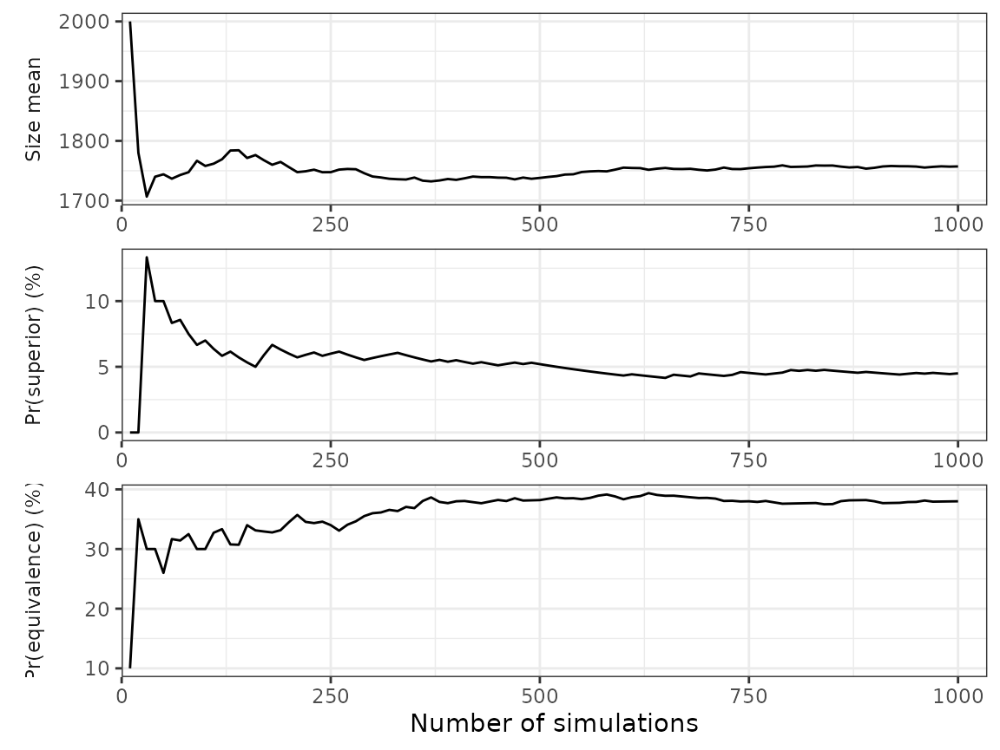
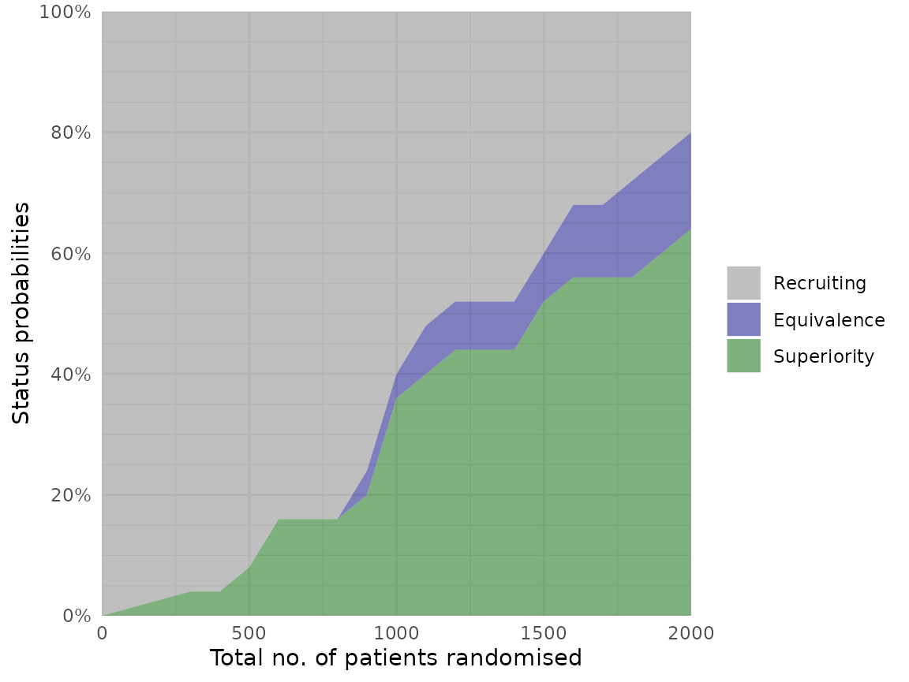
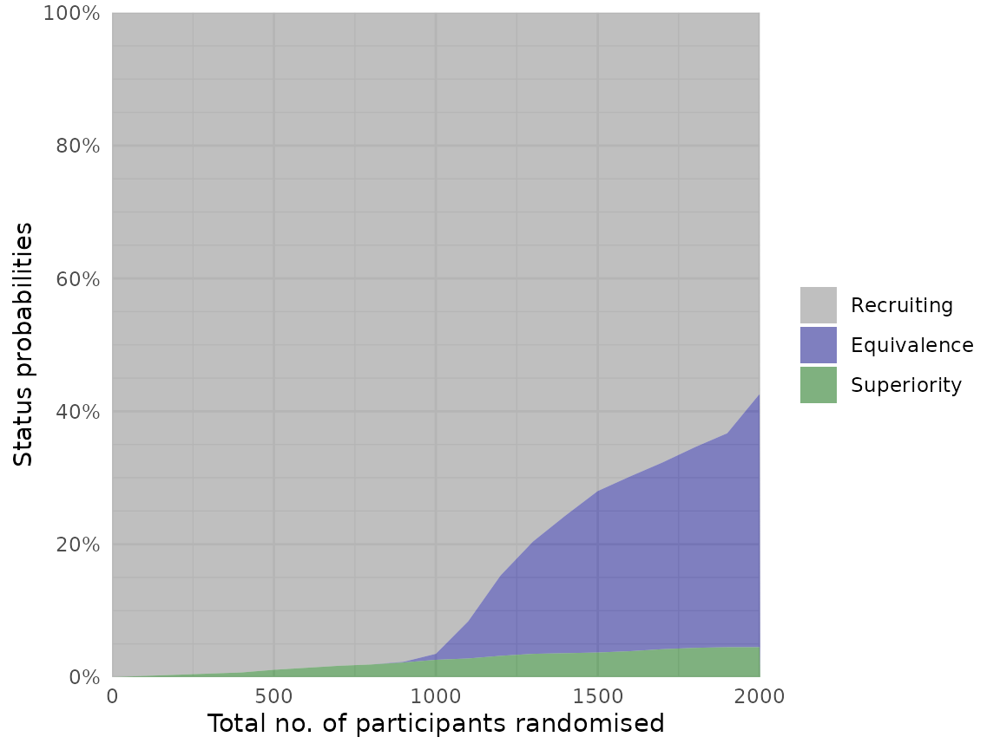
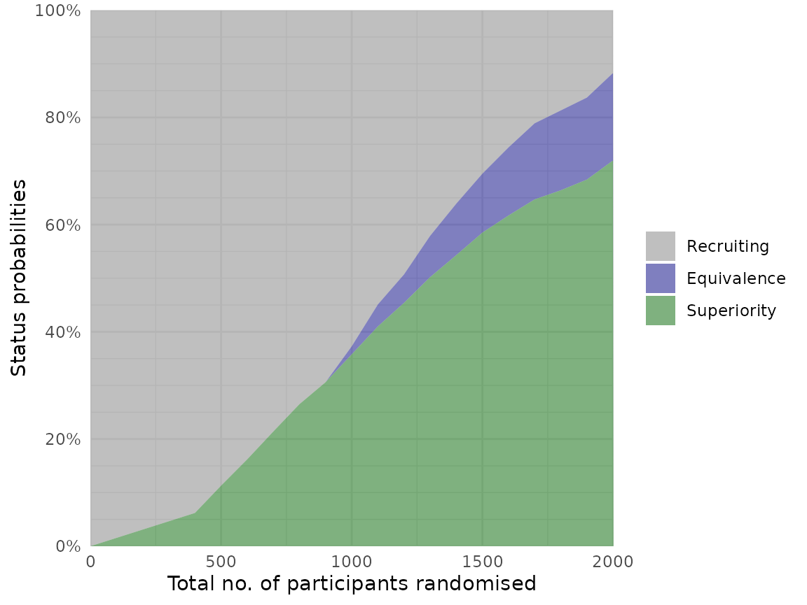
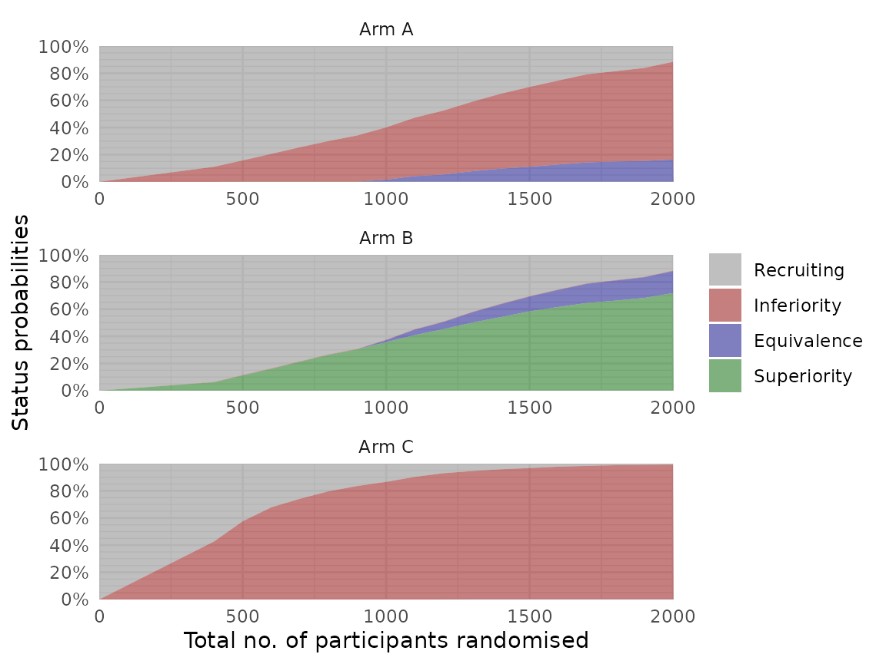
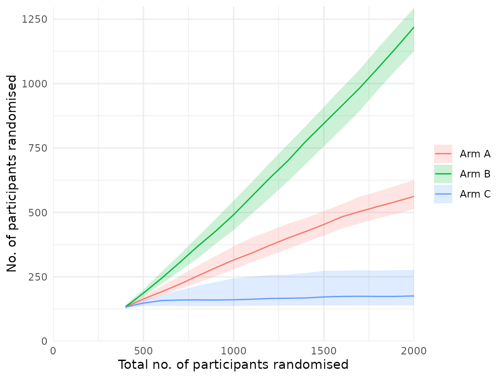

# Overview

The `adaptr` package simulates adaptive (multi-arm, multi-stage)
clinical trials using adaptive stopping, adaptive arm dropping and/or
response-adaptive randomisation.

The package has been developed as part of the [INCEPT (Intensive Care
Platform Trial) project](https://incept.dk/), primarily supported by a
grant from [Sygeforsikringen “danmark”](https://www.sygeforsikring.dk/).

In addition to the package vignettes, a detailed tutorial on how to
design and evaluate Bayesian advanced adaptive clinical trials can be
found in the open access article *“[Designing and Evaluating Bayesian
Advanced Adaptive Randomised Clinical Trials: A Practical
Guide](https://doi.org/10.1002/pst.70042)”* available in Pharmaceutical
Statistics.

Additional guidance on the key methodological considerations when
planning and comparing adaptive clinical trials can be found in the open
access article *“[An overview of methodological considerations regarding
adaptive stopping, arm dropping and randomisation in clinical
trials](https://doi.org/10.1016/j.jclinepi.2022.11.002)”* available in
Journal of Clinical Epidemiology.

## Usage and workflow overview

The central functionality of `adaptr` and the typical workflow is
illustrated here.

### Setup

First, the package is loaded:

``` r
library(adaptr)
#> Loading 'adaptr' package v1.5.0.
#> For instructions, type 'help("adaptr")'
#> or see https://inceptdk.github.io/adaptr/.
```

Following this, a cluster of parallel workers can be initiated by the
[`setup_cluster()`](https://inceptdk.github.io/adaptr/reference/setup_cluster.md)
function to facilitate parallel computing:

``` r
setup_cluster(1) # Replace '1' with number of parallel workers wanted
```

Parallelisation is supported in many `adaptr` functions, and a cluster
of parallel workers can be setup for the entire session using
[`setup_cluster()`](https://inceptdk.github.io/adaptr/reference/setup_cluster.md)
early in the script. Alternatively, parallelisation can be controlled by
the global `"mc.cores"` option (set by calling
`options(mc.cores = <number>)`) or the `cores` argument of many
functions.

This vignette does not use parallelisation, but this is generally
recommended when using `adaptr`.

### Specify trial design

Setup a trial specification (defining the trial design and scenario)
using the general
[`setup_trial()`](https://inceptdk.github.io/adaptr/reference/setup_trial.md)
function, or one of the special case variants using default priors
[`setup_trial_binom()`](https://inceptdk.github.io/adaptr/reference/setup_trial_binom.md)
(for binary, binomially distributed outcomes; used in this example) or
[`setup_trial_norm()`](https://inceptdk.github.io/adaptr/reference/setup_trial_norm.md)
(for continuous, normally distributed outcomes).

The example trial specification has the following characteristics:

- A binary, binomially distributed, undesirable (default) outcome
- Three arms with no designated common control
- Identical underlying outcome probabilities of 25% in each arm
- Analyses conducted when specific number of participants have outcome
  data available, with more participants randomised at all but the last
  look (lag due to follow-up and data collection/verification)
- No explicitly defined stopping thresholds for `inferiority` or
  `superiority` (default thresholds of \< 1% and \> 99%, respectively,
  apply)
- Equivalence stopping rule defined as \> 90% probability
  (`equivalence_prob`) of between-arm differences of all remaining arms
  being \< 5 %-points
- Response-adaptive randomisation with minimum allocation probabilities
  of 20% and softening of allocation ratios by a constant factor
  (`soften_power`)

See `?setup_trial()` for details on all the arguments or
[`vignette("Basic-examples", "adaptr")`](https://inceptdk.github.io/adaptr/articles/Basic-examples.md)
for **basic** example trial specifications and a thorough review of the
general trial specification settings, and
[`vignette("Advanced-example", "adaptr")`](https://inceptdk.github.io/adaptr/articles/Advanced-example.md)
for an **advanced** example including details on how to specify
user-written functions for generating outcomes and posterior draws.

Below, the trial specification is setup and a human-readable overview
printed:

``` r
binom_trial <- setup_trial_binom(
  arms = c("Arm A", "Arm B", "Arm C"),
  true_ys = c(0.25, 0.25, 0.25),
  min_probs = rep(0.20, 3),
  data_looks = seq(from = 300, to = 2000, by = 100),
  randomised_at_looks = c(seq(from = 400, to = 2000, by = 100), 2000),
  equivalence_prob = 0.9,
  equivalence_diff = 0.05,
  soften_power = 0.5
)

print(binom_trial, prob_digits = 3)
#> Trial specification: generic binomially distributed outcome trial
#> * Undesirable outcome
#> * No common control arm
#> * Best arms: Arm A and Arm B and Arm C
#> 
#> Arms, true outcomes, starting allocation probabilities 
#> and allocation probability limits (fixed/min/max_probs not rescaled):
#>   arms true_ys start_probs fixed_probs min_probs max_probs
#>  Arm A    0.25       0.333          NA       0.2        NA
#>  Arm B    0.25       0.333          NA       0.2        NA
#>  Arm C    0.25       0.333          NA       0.2        NA
#> 
#> Maximum sample size: 2000 
#> Maximum number of data looks: 18
#> Planned data looks after:  300, 400, 500, 600, 700, 800, 900, 1000, 1100, 1200, 1300, 1400, 1500, 1600, 1700, 1800, 1900, 2000 participants have reached follow-up
#> Number of participants randomised at each look:  400, 500, 600, 700, 800, 900, 1000, 1100, 1200, 1300, 1400, 1500, 1600, 1700, 1800, 1900, 2000, 2000
#> 
#> Superiority threshold: 0.99 (all analyses)
#> Inferiority threshold: 0.01 (all analyses)
#> Equivalence threshold: 0.9 (all analyses) (no common control)
#> Absolute equivalence difference: 0.05
#> No futility threshold (not relevant - no common control)
#> Adaptation rule probability thresholds not rescaled when arms are dropped
#> Soften power for all analyses: 0.5
```

By default, (most) probabilities are shown with 3 decimals. This can be
changed by explicitly
[`print()`](https://inceptdk.github.io/adaptr/reference/print.md)ing the
specification with the `prob_digits` arguments, for example:

``` r
print(binom_trial, prob_digits = 2)
#> Trial specification: generic binomially distributed outcome trial
#> * Undesirable outcome
#> * No common control arm
#> * Best arms: Arm A and Arm B and Arm C
#> 
#> Arms, true outcomes, starting allocation probabilities 
#> and allocation probability limits (fixed/min/max_probs not rescaled):
#>   arms true_ys start_probs fixed_probs min_probs max_probs
#>  Arm A    0.25        0.33          NA       0.2        NA
#>  Arm B    0.25        0.33          NA       0.2        NA
#>  Arm C    0.25        0.33          NA       0.2        NA
#> 
#> Maximum sample size: 2000 
#> Maximum number of data looks: 18
#> Planned data looks after:  300, 400, 500, 600, 700, 800, 900, 1000, 1100, 1200, 1300, 1400, 1500, 1600, 1700, 1800, 1900, 2000 participants have reached follow-up
#> Number of participants randomised at each look:  400, 500, 600, 700, 800, 900, 1000, 1100, 1200, 1300, 1400, 1500, 1600, 1700, 1800, 1900, 2000, 2000
#> 
#> Superiority threshold: 0.99 (all analyses)
#> Inferiority threshold: 0.01 (all analyses)
#> Equivalence threshold: 0.9 (all analyses) (no common control)
#> Absolute equivalence difference: 0.05
#> No futility threshold (not relevant - no common control)
#> Adaptation rule probability thresholds not rescaled when arms are dropped
#> Soften power for all analyses: 0.5
```

### Calibration

In the example trial specification, there are no true between-arm
differences, and stopping rules for inferiority and superiority are not
explicitly defined. This is intentional, as these stopping rules will be
calibrated to obtain a desired probability of stopping for superiority
in the scenario with no between-arm differences (corresponding to the
Bayesian type 1 error rate). Trial specifications do not necessarily
have to be calibrated. Instead, simulations can be run directly using
the
[`run_trials()`](https://inceptdk.github.io/adaptr/reference/run_trials.md)
function covered below (or
[`run_trial()`](https://inceptdk.github.io/adaptr/reference/run_trial.md)
for a single simulation). This can be followed by assessment of
performance metrics, and manually changing the specification (including
the stopping rules) until performance metrics are considered acceptable.
In this example, a full calibration procedure is performed.

Calibration of a trial specification is done using the
[`calibrate_trial()`](https://inceptdk.github.io/adaptr/reference/calibrate_trial.md)
function, which defaults to calibrate constant, symmetrical stopping
rules for inferiority and superiority (expecting a trial specification
with identical outcomes in each arm), but can be used to calibrate any
parameter in a trial specification towards any performance metric if a
user-defined calibration function (`fun`) is specified.

To perform the calibration, a `target` value, a `search_range`, a
tolerance value (`tol`), and the allowed direction of the tolerance
value (`dir`) must be specified (or alternatively, the defaults can be
used). Of note, the number of simulations in each calibration step here
is lower than generally recommended (to reduce the time required to
build this vignette):

``` r
# Calibrate the trial specification
calibrated_binom_trial <- calibrate_trial(
  trial_spec = binom_trial,
  n_rep = 1000, # 1000 simulations for each step (more generally recommended)
  base_seed = 4131, # Base random seed (for reproducible results)
  target = 0.05, # Target value for calibrated metric (default value)
  search_range = c(0.9, 1), # Search range for superiority stopping threshold
  tol = 0.01, # Tolerance range
  dir = -1 # Tolerance range only applies below target
)

# Print result (to check if calibration is successful)
calibrated_binom_trial
#> Trial calibration:
#> * Result: calibration successful
#> * Best x: 0.9830921
#> * Best y: 0.045
#> 
#> Central settings:
#> * Target: 0.05
#> * Tolerance: 0.01 (at or below target, range: 0.04 to 0.05)
#> * Search range: 0.9 to 1
#> * Gaussian process controls:
#> * - resolution: 5000
#> * - kappa: 0.5
#> * - pow: 1.95
#> * - lengthscale: 1 (constant)
#> * - x scaled: yes
#> * Noisy: no
#> * Narrowing: yes
#> 
#> Calibration/simulation details:
#> * Total evaluations: 4 (previous + grid + iterations)
#> * Repetitions: 1000
#> * Calibration time: 1.76 mins
#> * Base random seed: 4131
#> 
#> See 'help("calibrate_trial")' for details.
```

The calibration is successful (if not, results should not be used, and
the calibration settings should be changed and the calibration
repeated). The calibrated, constant stopping threshold for superiority
is printed with the results (0.9830921) and can be extracted using
`calibrated_binom_trial$best_x`. Using the default calibration
functionality, the calibrated, constant stopping threshold for
inferiority is symmetrical, i.e.,
`1 - stopping threshold for superiority` (0.0169079). The calibrated
trial specification may be extracted using
`calibrated_binom_trial$best_trial_spec` and, if printed, will also
include the calibrated stopping thresholds.

Calibration results may be saved and reloaded by using the `path`
argument, to avoid unnecessary repeated simulations.

### Summarising results

The results of the simulations using the calibrated trial specification
conducted during the calibration procedure may be extracted using
`calibrated_binom_trial$best_sims`. These results can be summarised with
several functions. Most of these functions support different ‘selection
strategies’ for simulations not ending with superiority, i.e.,
performance metrics can be calculated assuming different arms would be
used in clinical practice if no arm is ultimately superior.

The
[`check_performance()`](https://inceptdk.github.io/adaptr/reference/check_performance.md)
function summarises performance metrics in a tidy `data.frame`, with
uncertainty measures (bootstrapped confidence intervals) if requested.
Here, performance metrics are calculated considering the ‘best’ arm
(i.e., the one with the highest probability of being overall best)
selected in simulations not ending with superiority:

``` r
# Calculate performance metrics with uncertainty measures
binom_trial_performance <- check_performance(
  calibrated_binom_trial$best_sims,
  select_strategy = "best",
  uncertainty = TRUE, # Calculate uncertainty measures
  n_boot = 1000, # 1000 bootstrap samples (more typically recommended)
  ci_width = 0.95, # 95% confidence intervals (default)
  boot_seed = "base" # Use same random seed for bootstrapping as for simulations
)

# Print results 
print(binom_trial_performance, digits = 2)
#>                   metric     est err_sd err_mad   lo_ci   hi_ci
#> 1           n_summarised 1000.00   0.00    0.00 1000.00 1000.00
#> 2              size_mean 1757.20  11.26   11.12 1736.20 1779.10
#> 3                size_sd  370.74   9.31    9.34  353.87  389.70
#> 4            size_median 2000.00   0.00    0.00 2000.00 2000.00
#> 5               size_p25 1500.00  47.25    0.00 1400.00 1500.00
#> 6               size_p75 2000.00   0.00    0.00 2000.00 2000.00
#> 7                size_p0  400.00     NA      NA      NA      NA
#> 8              size_p100 2000.00     NA      NA      NA      NA
#> 9            sum_ys_mean  440.16   2.90    2.91  434.50  445.89
#> 10             sum_ys_sd   95.56   2.34    2.41   91.15  100.14
#> 11         sum_ys_median  487.00   1.36    0.74  484.00  489.00
#> 12            sum_ys_p25  366.00   9.63    8.90  353.00  387.00
#> 13            sum_ys_p75  506.00   1.09    1.48  504.00  508.00
#> 14             sum_ys_p0   88.00     NA      NA      NA      NA
#> 15           sum_ys_p100  572.00     NA      NA      NA      NA
#> 16         ratio_ys_mean    0.25   0.00    0.00    0.25    0.25
#> 17           ratio_ys_sd    0.01   0.00    0.00    0.01    0.01
#> 18       ratio_ys_median    0.25   0.00    0.00    0.25    0.25
#> 19          ratio_ys_p25    0.24   0.00    0.00    0.24    0.24
#> 20          ratio_ys_p75    0.26   0.00    0.00    0.26    0.26
#> 21           ratio_ys_p0    0.19     NA      NA      NA      NA
#> 22         ratio_ys_p100    0.30     NA      NA      NA      NA
#> 23       prob_conclusive    0.42   0.02    0.01    0.39    0.45
#> 24         prob_superior    0.04   0.01    0.01    0.03    0.06
#> 25      prob_equivalence    0.38   0.02    0.01    0.35    0.41
#> 26         prob_futility    0.00   0.00    0.00    0.00    0.00
#> 27              prob_max    0.58   0.02    0.01    0.55    0.61
#> 28 prob_select_arm_Arm A    0.35   0.01    0.01    0.32    0.38
#> 29 prob_select_arm_Arm B    0.33   0.01    0.01    0.30    0.36
#> 30 prob_select_arm_Arm C    0.32   0.01    0.01    0.29    0.35
#> 31      prob_select_none    0.00   0.00    0.00    0.00    0.00
#> 32                  rmse    0.02   0.00    0.00    0.02    0.02
#> 33               rmse_te      NA     NA      NA      NA      NA
#> 34                   mae    0.01   0.00    0.00    0.01    0.01
#> 35                mae_te      NA     NA      NA      NA      NA
#> 36                   idp      NA     NA      NA      NA      NA
```

Similar results in `list` format (without uncertainty measures) can be
obtained using the
[`summary()`](https://inceptdk.github.io/adaptr/reference/summary.md)
method (as known from, e.g., regression models in`R`), which comes with
a [`print()`](https://inceptdk.github.io/adaptr/reference/print.md)
method providing formatted results. If the simulation results are
printed directly, this function is called with the default arguments
(all arguments, e.g., selection strategies may also be directly supplied
to the [`print()`](https://inceptdk.github.io/adaptr/reference/print.md)
method).

``` r
binom_trial_summary <- summary(
  calibrated_binom_trial$best_sims,
  select_strategy = "best"
)

print(binom_trial_summary, digits = 2)
#> Multiple simulation results: generic binomially distributed outcome trial
#> * Undesirable outcome
#> * Number of simulations: 1000
#> * Number of simulations summarised: 1000 (all trials)
#> * No common control arm
#> * Selection strategy: best remaining available
#> * Treatment effect compared to: no comparison
#> 
#> Performance metrics (using posterior estimates from final analysis [all participants]):
#> * Sample sizes: mean 1757.20 (SD: 370.74) | median 2000.00 (IQR: 1500.00 to 2000.00) [range: 400.00 to 2000.00]
#> * Total summarised outcomes: mean 440.16 (SD: 95.56) | median 487.00 (IQR: 366.00 to 506.00) [range: 88.00 to 572.00]
#> * Total summarised outcome rates: mean 0.2503 (SD: 0.0109) | median 0.2500 (IQR: 0.2435 to 0.2573) [range: 0.1900 to 0.2950]
#> * Conclusive: 42.50%
#> * Superiority: 4.50%
#> * Equivalence: 38.00%
#> * Futility: 0.00% [not assessed]
#> * Inconclusive at max sample size: 57.50%
#> * Selection probabilities: Arm A: 35.10% | Arm B: 32.90% | Arm C: 32.00% | None: 0.00%
#> * RMSE / MAE: 0.01767 / 0.01164
#> * RMSE / MAE treatment effect: not estimated / not estimated
#> * Ideal design percentage: not estimable
#> 
#> Simulation details:
#> * Simulation time: 40.1 secs
#> * Base random seed: 4131
#> * Credible interval width: 95%
#> * Number of posterior draws: 5000
#> * Estimation method: posterior medians with MAD-SDs
```

Individual simulation results can be extracted in a tidy `data.frame`
using
[`extract_results()`](https://inceptdk.github.io/adaptr/reference/extract_results.md):

``` r
binom_trial_results <- extract_results(
  calibrated_binom_trial$best_sims,
  select_strategy = "best"
)

nrow(binom_trial_results) # Number of rows/simulations
#> [1] 1000

head(binom_trial_results) # Print the first rows
#>   sim final_n sum_ys ratio_ys final_status superior_arm selected_arm
#> 1   1    2000    478   0.2390  equivalence         <NA>        Arm A
#> 2   2    2000    488   0.2440          max         <NA>        Arm A
#> 3   3    2000    521   0.2605          max         <NA>        Arm C
#> 4   4    2000    500   0.2500          max         <NA>        Arm C
#> 5   5    2000    471   0.2355          max         <NA>        Arm A
#> 6   6    2000    503   0.2515          max         <NA>        Arm B
#>             err       sq_err err_te sq_err_te
#> 1 -0.0134029565 1.796392e-04     NA        NA
#> 2 -0.0118977741 1.415570e-04     NA        NA
#> 3  0.0004940695 2.441046e-07     NA        NA
#> 4 -0.0127647255 1.629382e-04     NA        NA
#> 5 -0.0232813002 5.420189e-04     NA        NA
#> 6 -0.0154278469 2.380185e-04     NA        NA
```

Finally, the probabilities of different remaining arms and their
statuses (with uncertainty) at the last adaptive analysis can be
summarised using the
[`check_remaining_arms()`](https://inceptdk.github.io/adaptr/reference/check_remaining_arms.md)
function (dropped arms will be shown with an empty text string):

``` r
check_remaining_arms(
  calibrated_binom_trial$best_sims,
  ci_width = 0.95 # 95% confidence intervals (default)
)
#>     arm_Arm A   arm_Arm B   arm_Arm C   n  prop         se      lo_ci
#> 1      active      active      active 528 0.528 0.02172556 0.48541868
#> 2             equivalence equivalence 121 0.121 0.02964793 0.06289112
#> 3 equivalence equivalence             120 0.120 0.02966479 0.06185807
#> 4 equivalence             equivalence 108 0.108 0.02986637 0.04946299
#> 5 equivalence equivalence equivalence  31 0.031 0.03112876 0.00000000
#> 6                            superior  22 0.022 0.03127299 0.00000000
#> 7                superior              14 0.014 0.03140064 0.00000000
#> 8    superior                           9 0.009 0.03148015 0.00000000
#>        hi_ci
#> 1 0.57058132
#> 2 0.17910888
#> 3 0.17814193
#> 4 0.16653701
#> 5 0.09201126
#> 6 0.08329394
#> 7 0.07554412
#> 8 0.07069997
```

### Visualising results

Several visualisation functions are included (all are optional, and all
require the `ggplot2` package installed).

Convergence and stability of one or more performance metrics may be
visually assessed using
[`plot_convergence()`](https://inceptdk.github.io/adaptr/reference/plot_convergence.md)
function:

``` r
plot_convergence(
  calibrated_binom_trial$best_sims,
  metrics = c("size mean", "prob_superior", "prob_equivalence"),
  # select_strategy can be specified, but does not affect the chosen metrics
)
```



Plotting other metrics is possible; see the
[`plot_convergence()`](https://inceptdk.github.io/adaptr/reference/plot_convergence.md)
documentation. The simulation results may also be split into separate,
consecutive batches when assessing convergence, to further assess the
stability:

``` r
plot_convergence(
  calibrated_binom_trial$best_sims,
  metrics = c("size mean", "prob_superior", "prob_equivalence"),
  n_split = 4
)
```



The status probabilities for the overall trial according to trial
progress can be visualised using the
[`plot_status()`](https://inceptdk.github.io/adaptr/reference/plot_status.md)
function:

``` r
plot_status(
  calibrated_binom_trial$best_sims,
  x_value = "total n" # Total number of randomised participants at X-axis
)
```


Similarly, the status probabilities for one or more specific trial arms
can be visualised:

``` r
plot_status(
  calibrated_binom_trial$best_sims,
  x_value = "total n",
  arm = NA # NA for all arms or character vector for specific arms
)
```



Finally, various metrics may be summarised over the progress of one or
multiple trial simulations using the
[`plot_history()`](https://inceptdk.github.io/adaptr/reference/plot_history.md)
function, which requires non-sparse results (the `sparse` argument must
be `FALSE` in `calibrate_trials()`,
[`run_trials()`](https://inceptdk.github.io/adaptr/reference/run_trials.md),
or
[`run_trial()`](https://inceptdk.github.io/adaptr/reference/run_trial.md),
leading to additional results being saved - all other functions work
with sparse results). This will be illustrated below.

### Use calibrated stopping thresholds in another scenario

The calibrated stopping thresholds (calibrated in a scenario with no
between-arm differences) may be used to run simulations with the same
overall trial specification, but according to a different scenario
(i.e., with between-arm differences present) to assess performance
metrics (including the Bayesian analogue of power).

First, a new trial specification is setup using the same settings as
before, except for between-arm differences and the calibrated stopping
thresholds:

``` r
binom_trial_calib_diff <- setup_trial_binom(
  arms = c("Arm A", "Arm B", "Arm C"),
  true_ys = c(0.25, 0.20, 0.30), # Different outcomes in the arms
  min_probs = rep(0.20, 3),
  data_looks = seq(from = 300, to = 2000, by = 100),
  randomised_at_looks = c(seq(from = 400, to = 2000, by = 100), 2000),
  # Stopping rules for inferiority/superiority explicitly defined
  # using the calibration results
  inferiority = 1 - calibrated_binom_trial$best_x,
  superiority = calibrated_binom_trial$best_x,
  equivalence_prob = 0.9,
  equivalence_diff = 0.05,
  soften_power = 0.5
)
```

Simulations using the trial specification with calibrated stopping
thresholds and differences present can then be conducted using the
[`run_trials()`](https://inceptdk.github.io/adaptr/reference/run_trials.md)
function. Here, we specify that non-sparse results will be returned (to
illustrate the
[`plot_history()`](https://inceptdk.github.io/adaptr/reference/plot_history.md)
function).

``` r
binom_trial_diff_sims <- run_trials(
  binom_trial_calib_diff,
  n_rep = 1000, # 1000 simulations (more generally recommended)
  base_seed = 1234, # Reproducible results
  sparse = FALSE # Return additional results for visualisation
)
```

Again, simulations may be saved and reloaded using the `path` argument.

We then calculate performance metrics as above:

``` r
check_performance(
  binom_trial_diff_sims,
  select_strategy = "best",
  uncertainty = TRUE,
  n_boot = 1000, # 1000 bootstrap samples (more typically recommended)
  ci_width = 0.95,
  boot_seed = "base"
)
#>                   metric      est err_sd err_mad    lo_ci    hi_ci
#> 1           n_summarised 1000.000  0.000   0.000 1000.000 1000.000
#> 2              size_mean 1245.100 16.618  17.272 1215.185 1277.702
#> 3                size_sd  510.702  7.414   7.436  496.194  525.386
#> 4            size_median 1200.000 46.824   0.000 1200.000 1300.000
#> 5               size_p25  800.000 35.902   0.000  800.000  900.000
#> 6               size_p75 1700.000 46.345   0.000 1600.000 1700.000
#> 7                size_p0  400.000     NA      NA       NA       NA
#> 8              size_p100 2000.000     NA      NA       NA       NA
#> 9            sum_ys_mean  287.066  3.697   3.827  280.241  294.549
#> 10             sum_ys_sd  113.660  1.697   1.650  110.337  116.954
#> 11         sum_ys_median  286.000  5.981   7.413  274.500  295.000
#> 12            sum_ys_p25  194.750  7.147   7.413  180.731  207.756
#> 13            sum_ys_p75  382.250  6.961   7.042  370.000  395.250
#> 14             sum_ys_p0   85.000     NA      NA       NA       NA
#> 15           sum_ys_p100  518.000     NA      NA       NA       NA
#> 16         ratio_ys_mean    0.233  0.000   0.001    0.232    0.234
#> 17           ratio_ys_sd    0.016  0.000   0.000    0.015    0.016
#> 18       ratio_ys_median    0.232  0.001   0.001    0.231    0.233
#> 19          ratio_ys_p25    0.222  0.001   0.001    0.220    0.224
#> 20          ratio_ys_p75    0.243  0.001   0.001    0.241    0.244
#> 21           ratio_ys_p0    0.196     NA      NA       NA       NA
#> 22         ratio_ys_p100    0.298     NA      NA       NA       NA
#> 23       prob_conclusive    0.882  0.011   0.010    0.862    0.902
#> 24         prob_superior    0.719  0.015   0.015    0.690    0.747
#> 25      prob_equivalence    0.163  0.012   0.012    0.139    0.185
#> 26         prob_futility    0.000  0.000   0.000    0.000    0.000
#> 27              prob_max    0.118  0.011   0.010    0.098    0.138
#> 28 prob_select_arm_Arm A    0.033  0.005   0.004    0.023    0.043
#> 29 prob_select_arm_Arm B    0.967  0.005   0.004    0.957    0.977
#> 30 prob_select_arm_Arm C    0.000  0.000   0.000    0.000    0.000
#> 31      prob_select_none    0.000  0.000   0.000    0.000    0.000
#> 32                  rmse    0.020  0.001   0.001    0.019    0.022
#> 33               rmse_te       NA     NA      NA       NA       NA
#> 34                   mae    0.011  0.000   0.000    0.010    0.012
#> 35                mae_te       NA     NA      NA       NA       NA
#> 36                   idp   98.350  0.264   0.222   97.849   98.850
```

Similarly, overall trial statuses for the scenario with differences are
visualised:

``` r
plot_status(binom_trial_diff_sims, x_value = "total n")
```



Statuses for each arm in this scenario are also visualised:

``` r
plot_status(binom_trial_diff_sims, x_value = "total n", arm = NA)
```


We can plot the median and interquartile ranges of allocation
probabilities in each arm over time using the
[`plot_history()`](https://inceptdk.github.io/adaptr/reference/plot_history.md)
function (requiring non-sparse results, leading to substantially larger
objects and files if saved):

``` r
plot_history(
  binom_trial_diff_sims,
  x_value = "total n",
  y_value = "prob"
)
```



Similarly, the median (interquartile range) number of participants
allocated to each arm as the trial progresses can be visualised:

``` r
plot_history(
  binom_trial_diff_sims,
  x_value = "total n",
  y_value = "n all"
)
```



Plotting other metrics is possible; see the
[`plot_history()`](https://inceptdk.github.io/adaptr/reference/plot_history.md)
documentation.

## Citation

If you use the package, please consider citing it:

``` r
citation(package = "adaptr")
#> To cite package 'adaptr' in publications use:
#> 
#>   Granholm A, Jensen AKG, Lange T, Kaas-Hansen BS (2022). adaptr: an R
#>   package for simulating and comparing adaptive clinical trials.
#>   Journal of Open Source Software, 7(72), 4284. URL
#>   https://doi.org/10.21105/joss.04284.
#> 
#>   Granholm A, Jensen AKG, Lange T, Perner A, Møller MH, Kaas-Hansen BS
#>   (2025). Designing and Evaluating Bayesian Advanced Adaptive
#>   Randomised Clinical Trials: A Practical Guide. Pharmaceutical
#>   Statistics, 24(6), e70042. URL https://doi.org/10.1002/pst.70042.
#> 
#> To see these entries in BibTeX format, use 'print(<citation>,
#> bibtex=TRUE)', 'toBibtex(.)', or set
#> 'options(citation.bibtex.max=999)'.
```
