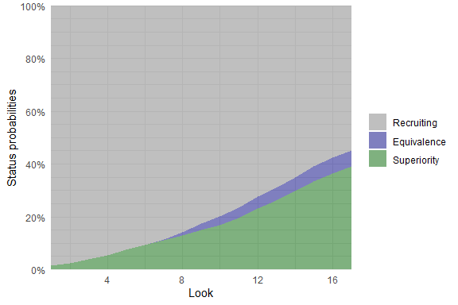
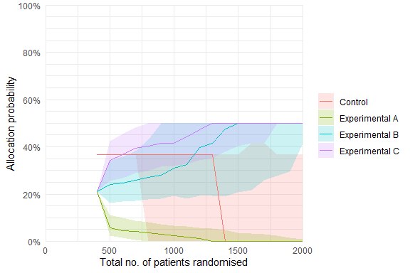

# Summary

The `adaptr` **R** package facilitates simulation and comparison of adaptive
clinical trial designs using Bayesian statistical methods. The package supports
a flexible number of arms, use of a common control, pre-specified and
user-defined outcome- and posterior-generating functions, fixed- and
response-adaptive randomisation (RAR), various adaptation rules for arm dropping
and stopping, calculation of trial design performance metrics, and visualisation
of results. Simulations are relatively fast, can run in parallel, and can be
reloaded from previous sessions.

# Statement of need

Adaptive clinical trials are more flexible and can be more efficient than
conventional randomised clinical trials (RCTs) with fixed sample sizes and
allocation ratios [@pallmann2018]. Because more efficient trials may be
preferable for economic, logistic and ethical reasons, the interest in adaptive
clinical trials is growing [@granholm2021]. Planning adaptive trials and
comparing adaptive trials designs is complex, however, and require statistical
simulation because simple, closed-form sample size calculations are impractical
Existing software is either closed source/commercial, has limited features or
flexibility, or based on graphical user interfaces that may hamper
reproducibility (unlike scripting-based tools) [@meyer2021].

# Overview and features

The `adaptr` R package [@rcore] focuses on multi-arm adaptive clinical trials
using adaptive stopping, arm dropping and/or response-adaptive randomisation
[@pallmann2018; @viele2020a]. Many realistic trial designs are supported by the
built-in functions and more advanced designs can be simulated with user-defined
functions.

**Table 1** gives an overview of the functionality of `adaptr`:

+-------------------+-----------------------------------------------------------+
| Category          | Description                                               |
+===================+===========================================================+
| **General**       | Allows for two or more intervention arms and comparison   |
|                   | of all arms or pairwise comparisons against a common      |
|                   | control arms.                                             |
|                   |                                                           |
|                   | Simulations use Bayesian statistics.                      |
+-------------------+-----------------------------------------------------------+
| **Outcomes and**  | Supports multiple outcome types specified by user-defined |
| **posteriors**    | functions, with built-in convenience functions for easy   |
|                   | use with binary, binomially distributed and continuous,   |
|                   | normally distributed outcomes.                            |
|                   |                                                           |
|                   | For more flexibility, user-defined functions for          |
|                   | generating outcomes and sampling from posterior           |
|                   | distributions are supported, and may use more complex     |
|                   | functions provided by other packages (e.g., Markov chain  |
|                   | Monte Carlo or variational inference).                    |
+-------------------+-----------------------------------------------------------+
| **Random**        | Supports fixed and response-adaptive randomisation, and   |
| **allocation**    | combinations thereof, including special handling of       |
|                   | control group allocation in trials with a common control  |
|                   | (e.g., matching highest non-control group allocation      |
|                   | ratio and square-root-ratio-based allocation              |
|                   | [@viele2020a; @park2020]).                                |
|                   |                                                           |
|                   | Supports minimum/maximum allocation limits and            |
|                   | *softening* non-fixed allocation probabilities by raising |
|                   | them to a power [@ryan2020] (may vary throughout the      |
|                   | trial) and normalising probabilities to sum to 100%.      |
+-------------------+-----------------------------------------------------------+
| **Adaptation**    | Supports probabilistic trial-stopping/arm-dropping rules  |
| **rules**         | for superiority, inferiority, and practical equivalence   |
|                   | between all arms in trial designs without a common        |
|                   | control.                                                  |
|                   |                                                           |
|                   | Supports probabilistic trial-stopping/arm-dropping rules  |
|                   | for superiority, inferiority, practical equivalence, and  |
|                   | futility compared to a common control in such designs.    |
|                   |                                                           |
|                   | In trial designs with a common control, a superior arm    |
|                   | becomes the new control. In these cases                   |
|                   | equivalence/futility testing may be continued (using the  |
|                   | new control) or disabled.                                 |
+-------------------+-----------------------------------------------------------+
| **Performance**   | Supports the calculation of various trial design          |
| **metrics**       | performance metrics [@viele2020a; @viele2020b] according  |
|                   | to different arm selection strategies in trials not       |
|                   | ending with superiority.                                  |
+-------------------+-----------------------------------------------------------+
| **Visualisation** | Offers graphical summaries of the overall or arm-specific |
|                   | statuses over time across multiple simulations (such as   |
|                   | still *recruting* or *trial stopped/arm dropped* for      |
|                   | various reasons), and relevant arm-specific metrics (e.g. |
|                   | allocation probabilities) over time across                |
|                   | single/multiple trial simulations.                        |
+-------------------+-----------------------------------------------------------+
| **Technical**     | Supports parallel execution on multiple using **R**'s     |
|                   | built-in `parallel` package.                              |
|                   |                                                           |
|                   | Allows reproducible results with seeding.                 |
|                   |                                                           |
|                   | Supports saving/loading large trial objects and *growing* |
|                   | previous simulation objects.                              |
|                   |                                                           |
|                   | Uses base **R** with no required external dependencies;   |
|                   | optional plotting functionality does, however, require    |
|                   | the `ggplot2`-package [@wickham2019].                     |
+-------------------+-----------------------------------------------------------+

: Overview of functionality in the `adaptr` package.

Adaptive analyses are conducted at specified recruitment numbers, with random
allocation of simulated patients to currently active arms. Both fixed and
response-adaptive randomisation (RAR) as well as combinations (including several
restrictions of RAR) are supported [@pallmann2018; @apt2019; @park2020;
@ryan2020]. Outcomes are then generated, followed by drawing samples from the
posterior distributions; the packages comes with built-in functions for
generating outcomes and posteriors using fast models with conjugate, flat priors
[@ryan2019], but more advanced estimation are allowed using user-defined
functions..

Posterior draws are used to calculate probabilities for (i) enforcing adaptive
trial-stopping/arm-dropping rules with respect to superiority, inferiority,
equivalence and/or futility, (ii) assessing the trial's final status
(superiority, inferiority, equivalence, futility, or stopped at a maximum
pre-specified sample size), and (iii) adjusting allocation probabilities if RAR
is used. Single or multiple trial simulations can be run, saved and grown, and
summarised using multiple relevant performance metrics [@viele2020a;
@viele2020b]. Performance metrics can be calculated under different assumptions
about the preferable intervention in clinical practice should the trials not end
with superiority.

# Functions and workflow

An overview of the principal functions in `adaptr` is given in **Table 2**:

+-----------------------+------------------------------------------------------+
| Function name         | Action                                               |
+=======================+======================================================+
| **`setup_trial`**,    | Defines the adaptive trial specification including   |
|                       | arms, true outcome rates, stopping rules,            |
| `setup_trial_binom`,  | outcome/posterior generating functions, and summary  |
|                       | settings.                                            |
| `setup_trial_norm`    |                                                      |
|                       | Full flexibility is provided by **`setup_trial`**;   |
|                       | the convenience functions `setup_trial_binom` and    |
|                       | `setup_trial_norm` provide sensible defaults for     |
|                       | binary, binomially distributed and continuous,       |
|                       | normally distributed outcomes, respectively.         |
+-----------------------+------------------------------------------------------+
| **`run_trial`**       | Runs a single simulation using a trial specification |
|                       | defined with `setup_trial`.                          |
+-----------------------+------------------------------------------------------+
| **`run_trials`**      | Runs multiple trial simulations using a trial        |
|                       | specification defined with `setup_trial`. Can save   |
|                       | simulation objects to external files and load/grow   |
|                       | previous simulations.                                |
+-----------------------+------------------------------------------------------+
| **`extract_results`** | Extracts key results and (partial) performance       |
|                       | metrics from multiple simulations conducted by       |
|                       | `run_trials` according to a specified arm selection  |
|                       | strategy for simulations not ending in superiority.  |
|                       | Returns a tidy `data.frame` with one simulation per  |
|                       | row [@wickham2019].                                  |
+-----------------------+------------------------------------------------------+
| **`summary`**         | Summarises, in a human-friendly way, key results and |
|                       | calculates overall performance metrics for multiple  |
|                       | simulations according to a specified arm selection   |
|                       | strategy for simulations not ending in superiority.  |
+-----------------------+------------------------------------------------------+
| **`plot_status`**     | Plots the overall statuses or arm-specific statuses  |
|                       | over multiple simulations over the course of         |
|                       | simulated trials.                                    |
+-----------------------+------------------------------------------------------+
| **`plot_history`**    | Plots the history of relevant metrics in each arm    |
|                       | for one or multiple simulations over the course of   |
|                       | the simulated trial(s).                              |
+-----------------------+------------------------------------------------------+
| **`print`**           | Print methods for printing the outputs of most of    |
|                       | the included functions in a human-friendly way.      |
+-----------------------+------------------------------------------------------+

: Overview of user-facing functions in `adaptr`.

`adaptr` is available on [CRAN](https://CRAN.R-project.org/package=adaptr) and
[GitHub](https://github.com/INCEPTdk/adaptr), where a
[stand-alone website](https://inceptdk.github.io/adaptr/) with the package
documentation is also available. `adaptr` can be installed using one
of the following commands:


```r
install.packages("adaptr") # CRAN

# install.packages("remotes")
remotes::install_github("INCEPTdk/adaptr") # GitHub, development version
```

Once installed, as any other R package, it is loaded with:


```r
library(adaptr)
#> Loading adaptr package (version 1.0.0).
#> See 'help("adaptr")' or 'vignette("Overview", "adaptr")' for help.
#> Further information available on https://github.com/INCEPTdk/adaptr/.
```

An adaptive trial design is specified with the generic `setup_trial` function
(requires used-defined functions to generate/compare outcomes), or one of the
helper functions `setup_trial_binom` or `setup_trial_norm` (wrappers around
`setup_trial` with appropriate functions for generating outcomes and sampling
from posterior distributions). For example, a simple trial with a binary,
binomially distributed outcome can be specified with:


```r
binom_trial <- setup_trial_binom(
   # Treatment arms
   arms = c("Control", "Experimental A", "Experimental B", "Experimental C"),
   
   # True event rates
   true_ys = c(0.25, 0.30, 0.22, 0.19),
   
   # Time of adaptive analyses
   # - first analysis when 400 patients are included, then after every 100
   data_looks = seq(from = 400, to = 2000, by = 100),
   
   # Name of the common control (leave undefined if no common control is desired)
   control = "Control",
   
   # Use square-root-ratio-based allocation (sqrt(number of non-control arms):1 
   # for each non-control arm), with fixed control group allocation and RAR in
   # the non-control arms
   control_prob_fixed = "sqrt-based",
   
   # Define stopping rules
   superiority = 0.99,
   inferiority = 0.01,
   equivalence_prob = 0.85, # Equivalence probability threshold
   equivalence_diff = 0.05, # Equivalence difference
   equivalence_only_first = TRUE, # Only assess equivalence for first control
   
   # Restrict non-fixed allocation ratios (limit extreme RAR)
   soften_power = 0.5
)

print(binom_trial)
#> Trial specification: generic binomially distributed outcome trial
#> * Undesirable outcome
#> * Common control arm: Control 
#> * Control arm probability fixed at 0.366 (for 4 arms), 0.414 (for 3 arms), 0.5 (for 2 arms)
#> * Best arm: Experimental C
#> 
#> Arms, true outcomes, starting allocation probabilities 
#> and allocation probability limits:
#>            arms true_ys start_probs fixed_probs min_probs max_probs
#>         Control    0.25       0.366       0.366        NA        NA
#>  Experimental A    0.30       0.211          NA        NA        NA
#>  Experimental B    0.22       0.211          NA        NA        NA
#>  Experimental C    0.19       0.211          NA        NA        NA
#> 
#> Maximum sample size: 2000 
#> Maximum number of data looks: 17
#> Planned data looks after:  400, 500, 600, 700, 800, 900, 1000, 1100, 1200, 1300, 1400, 1500, 1600, 1700, 1800, 1900, 2000 patients
#> 
#> Superiority threshold: 0.99 
#> Inferiority threshold: 0.01 
#> Equivalence threshold: 0.85 (only checked for first control)
#> Absolute equivalence difference: 0.05
#> No futility threshold
#> Soften power for all analyses: 0.5
```

Once specified, simulating a single trial is easy:


```r
run_trial(binom_trial, seed = 202203) # Fixed random seed
#> Single simulation result: generic binomially distributed outcome trial
#> * Undesirable outcome
#> * Initial/final common control arms: Control/Experimental C
#> 
#> Final status: inconclusive, stopped at maximum sample size
#> Final/maximum allowed sample sizes: 2000/2000 (100.0%)
#> 
#> Final trial results:
#>            arms true_ys sum_ys  ns raw_ests post_ests post_errs lo_cri hi_cri
#>         Control    0.25     42 145    0.290     0.293    0.0375  0.223  0.366
#>  Experimental A    0.30     27  87    0.310     0.314    0.0492  0.223  0.415
#>  Experimental B    0.22    192 888    0.216     0.217    0.0138  0.190  0.245
#>  Experimental C    0.19    165 880    0.188     0.188    0.0133  0.163  0.215
#>  final_status status_look status_probs final_alloc
#>      inferior         400       0.0032       0.366
#>      inferior         400       0.0036       0.211
#>        active          NA           NA       0.500
#>       control          NA           NA       0.500
#> 
#> Simulation details:
#> * Random seed: 202203
#> * Credible interval width: 95%
#> * Number of posterior draws: 5000
#> * Posterior estimation method: medians with MAD-SDs
```

---so is running multiple trials, for example 1000. If `cores` \> 1, simulations
are runs in parallel on the number of cores specified. Setting `sparse = FALSE`
keeps all intermediate simulation results; this is required for `plot_history`
(see below) but makes the object a lot larger (in this case, by a factor 15).


```r
sims <- run_trials(trial_spec = binom_trial, n_rep = 1000, cores = 4, 
                   base_seed = 202204, sparse = FALSE)
```

## Numerical results

We summarise the results, assuming the control arm would be used practice in
case of inconclusive trials (unless the control group is dropped early):


```r
summary(sims, select_strategy = "control")
#> Multiple simulation results: generic binomially distributed outcome trial
#> * Undesirable outcome
#> * Number of simulations: 1000
#> * Number of simulations summarised: 1000 (all trials)
#> * Common control arm: Control
#> * Selection strategy: first control if available (otherwise no selection)
#> * Treatment effect compared to: no comparison
#> 
#> Performance metrics (using posterior estimates):
#> * Sample sizes: mean 1708.3 (SD: 438.0) | median 2000.0 (IQR: 1500.0 to 2000.0)
#> * Total summarised outcomes: mean 382.5 (SD: 96.4) | median 422.0 (IQR: 338.8 to 449.0)
#> * Total summarised outcome rates: mean 0.225 (SD: 0.014) | median 0.225 (IQR: 0.216 to 0.234)
#> * Conclusive: 45.2%
#> * Superiority: 39.0%
#> * Equivalence: 6.2%
#> * Futility: 0.0% [not assessed]
#> * Inconclusive at max sample size: 54.8%
#> * Selection probabilities: Control: 24.0% | Experimental A: 0.0% | Experimental B: 1.3% | Experimental C: 33.1% | None: 41.6%
#> * RMSE: 0.02742
#> * RMSE treatment effect: 0.04741
#> * Ideal design percentage: 77.0%
#> 
#> Simulation details:
#> * Simulation time: 19.9 secs
#> * Base random seed: 202204
#> * Credible interval width: 95%
#> * Number of posterior draws: 5000
#> * Estimation method: posterior medians with MAD-SDs
```

Alternatively, we can get *tidy* results [@wickham2019] for each simulation
using the same selection strategy as above:


```r
extr_res <- extract_results(sims, select_strategy = "control")

head(extr_res)
#>   sim final_n sum_ys  ratio_ys final_status   superior_arm   selected_arm
#> 1   1    2000    436 0.2180000          max           <NA>           <NA>
#> 2   2    2000    452 0.2260000          max           <NA>           <NA>
#> 3   3    1800    389 0.2161111  superiority Experimental C Experimental C
#> 4   4    2000    440 0.2200000          max           <NA>           <NA>
#> 5   5     500    118 0.2360000  superiority Experimental B Experimental B
#> 6   6     900    182 0.2022222  superiority Experimental C Experimental C
#>         sq_err   sq_err_te
#> 1           NA          NA
#> 2           NA          NA
#> 3 0.0004297484 0.004184831
#> 4           NA          NA
#> 5 0.0078199784 0.015558136
#> 6 0.0019097953 0.001558565
```

## Visual summaries

Here we plot the overall trial statuses (reasons for stopping each trial) at
each adaptive analysis using:


```r
plot_status(sims)
```



The overall allocation probabilities in each arm (y axis) against the total
number of patients included in the trial (x axis) are plotted using:


```r
# Requires sparse = FALSE in run_trials
plot_history(sims, x_value = "total n", y_value = "prob")
```



Arm-specific statuses and additional metrics over time may be plotted as well.

# Discussion

We have developed a flexible, extensible and comprehensive **R** package that
allows relatively easy and efficient simulation of adaptive clinical trials
using various features with few, well-documented user-facing functions.

The package facilitates planning of adaptive clinical trials and comparison of
trial designs using combinations of the most important and common adaptive
features. In addition to the efficient convenience functions provided for common
outcome types, more complex models are supported but may increase simulation
time substantially and require (highly) parallel execution on multiple cores
locally and/or remotely using cloud computing.

While relatively feature rich, the package currently has some limitations. These
primarily include the lack of a 'flooring' option (stopping allocation to arms
when their probabilities of being the best fall below a certain threshold,
possibly with subsequent resumption of allocation [@viele2020a]), inability to
add arms during the conduct (as done in adaptive platform trials [@apt2019];
this is complex and generally not supported in other software [@meyer2021]) and
the lack of separate stopping rules/allocation ratios in subgroups or enrichment
(similarly complex [@apt2019]). Finally, the package uses Bayesian statistical
methods as these are well-suited for adaptive trials and easily extended;
frequentist statistical methods are not supported.

In conclusion, the `adaptr` **R** package provides a feature-rich and extensible
open-source, scripting-based solution for planning, simulating and comparing
adaptive clinical trials.

# Acknowledgement

`adaptr` has been developed as part of the [Intensive Care Platform Trial
programme](https://www.incept.dk), which has primarily been funded by a grant
from [Sygeforsikringen "danmark"](https://www.sygeforsikring.dk).

# References
